# WEB开发（Servlet+JSP）

## BS架构与CS架构

**1.CS = Client - Server =客户端—服务器**

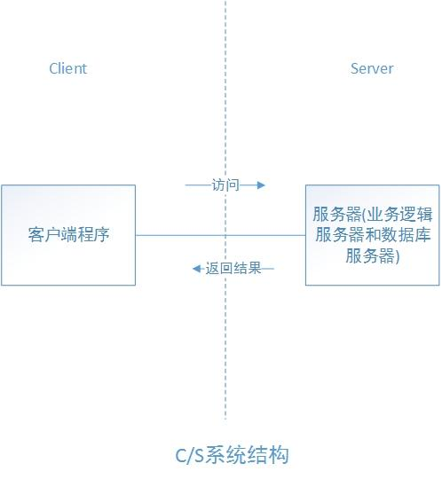

**2.BS = Browser - Server = 浏览器 - 服务器**

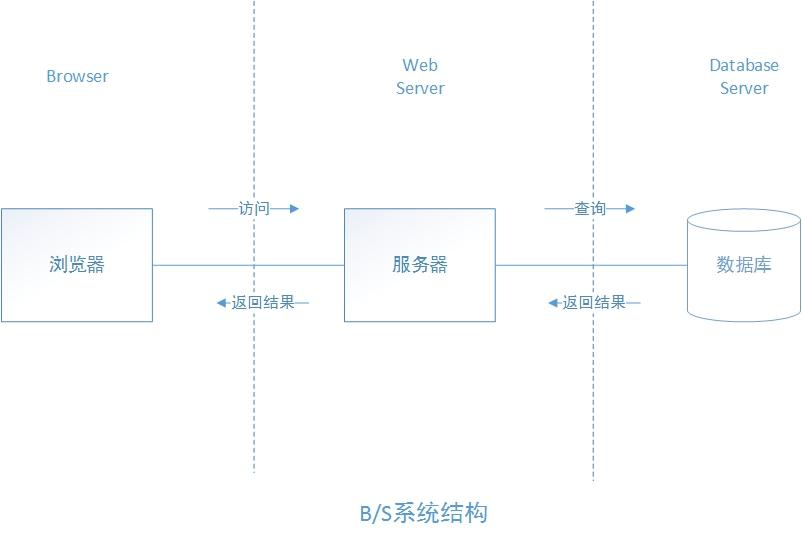

**1、客户端要求**
C/S客户端的计算机电脑配置要求较高。
B/S客户端的计算机电脑配置要求较低。

**2、软件安装**
C/S每一个客户端都必须安装和配置专用的软件。
B/S最大的优点就是不用安装任何专门的软件，只要有一个浏览器就可以。

**3、软件升级和维护**
C/S每一个客户端都要进行升级和维护。

B/S客户端不必安装及维护。

**4、安全性**

C/S一般面向相对固定的用户群，它可以对权限进行多层次校验，提供了更安全的存取模式，对信息安全的控制能力很强。一般高度机密的信息系统应采用C/S结构。

## web服务器

服务器有硬件和软件之分，一般我们认为的服务器都是硬件层面的,指代的是一台配置比较高的计算机，那么服务器也有软件层面的，软件层面指的就是服务器软件。

**常见的服务器软件：**

**1.Tomcat**    （课程使用） 

是Apache 软件基金会（Apache Software Foundation）的Jakarta 项目中的一个核心项目，由Apache、Sun 和其他一些公司及个人共同开发而成

**2.Jetty**

 是一个开源的servlet容器，它为基于Java的web内容，例如JSP和servlet提供运行环境。Jetty是使用Java语言编写的，它的API以一组JAR包的形式发布

**3.Nginx** 

不仅是一个小巧且高效的HTTP服务器，也可以做一个高效的负载均衡反向代理，通过它接受用户的请求并分发到多个进程可以极大提高应用的并发能力

**4.IIS** 

是英文Internet Information Server的缩写，译成中文就是Internet信息服务的意思。它是微软公司主推的服务器。

## **Tomcat服务器安装**

> 访问官网下载 https://tomcat.apache.org/

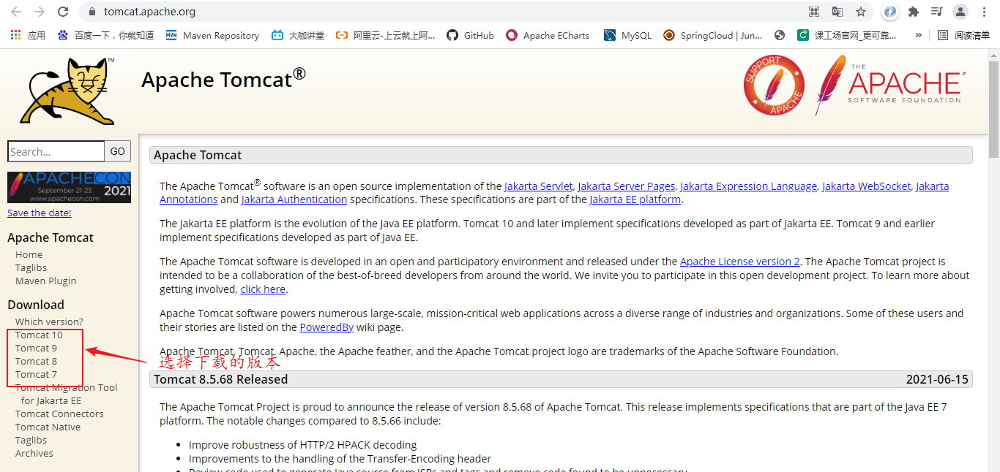

点击Tomcat8，进入下载界面

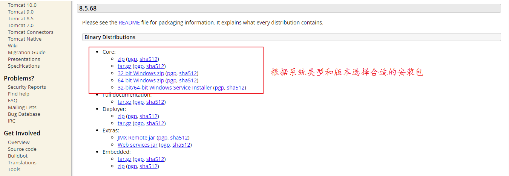

下载完成安装即可，`安装之前必须要有java的运行环境，因为tomcat需要依赖jre,且要保证配置了JAVA_HOME否则启动tomcat会闪退。`

## Tomcat的目录结构

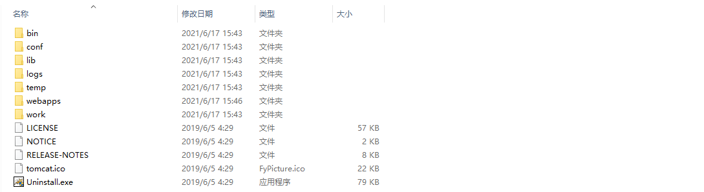

**bin:** 可执行的二进制文件

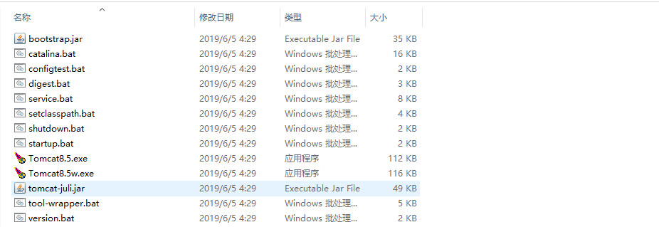

**conf:** 服务器的配置文件

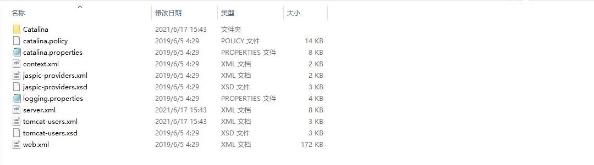

**lib:**服务器运行时的依赖

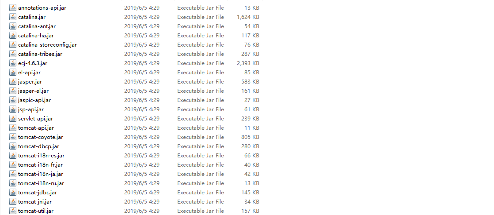

**logs:**服务器运行时的日志文件

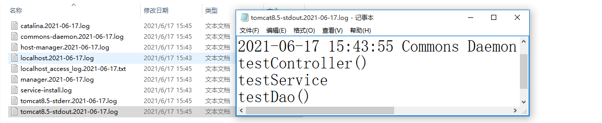

**temp:**运行时产生的临时文件

**webapps:**发布项目存放的包


**work:**存放jsp页面编译后的代码

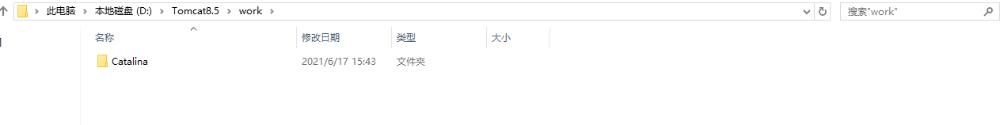

## Tomcat发布静态项目

方式1：直接将项目复制到tomcat的webapps目录中

方式2：通过配置虚拟路径，实现项目的发布，修改tomcat配置文件中的web.xml

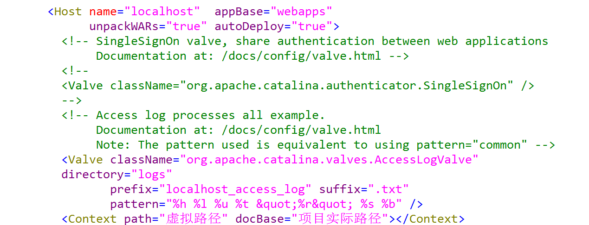

```xml
<Context path="虚拟路径" docBase="项目实际路径"></Context>
```

## 开发工具（Eclipse/IDEA）集成Tomcat

**1.Eclipse**

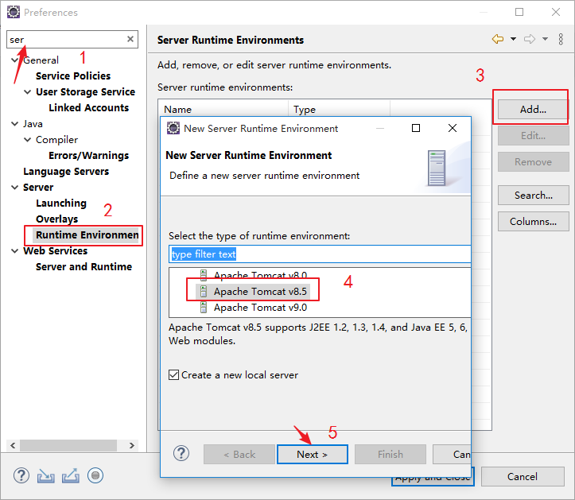

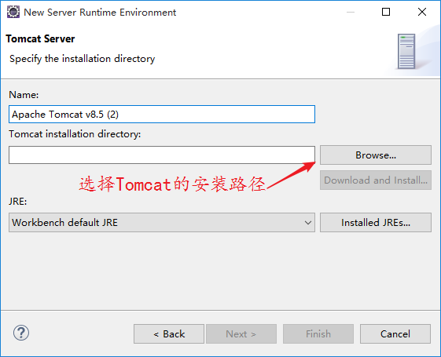

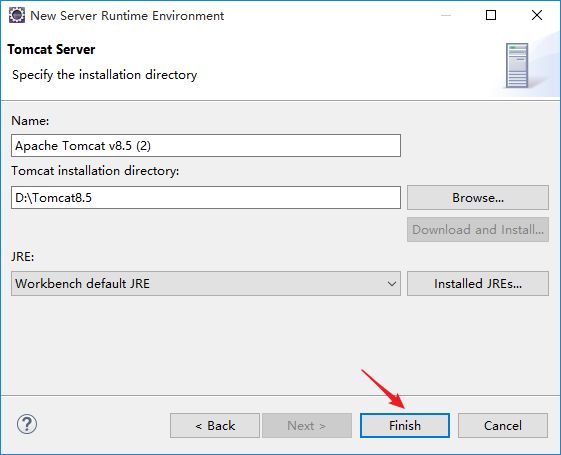

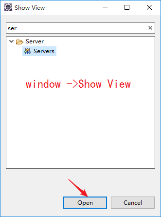


**2.IDEA**

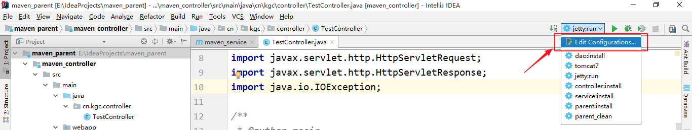

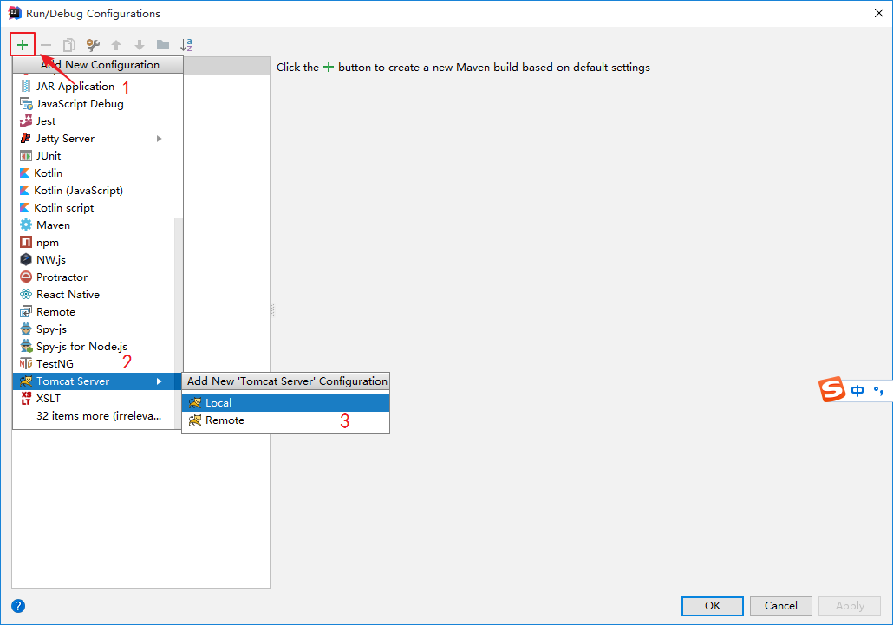

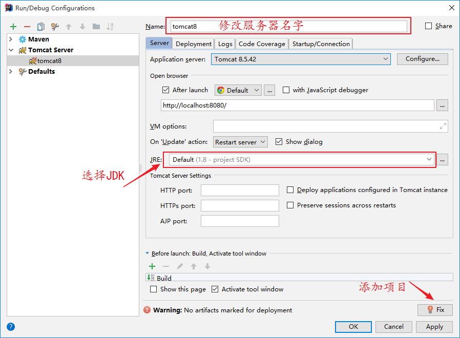

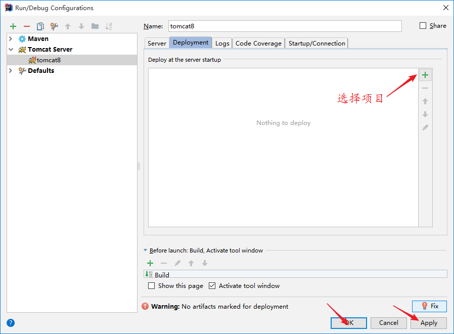

配置完成

## Servlet

**1.什么是servlet**

Java Servlet 是运行在 Web 服务器或应用服务器上的程序，使用 Servlet可以收集来自网页表单的用户输入，呈现来自数据库或者其他源的记录，还可以动态创建网页。

web服务器只能处理静态的资源，不能处理动态的页面，所以需要扩展其功能，因此使用servlet就能扩展其功能，web服务器收到请求后，如果需要计算，则调用servlet进行处理。

## Servlet快速入门

1.写一个java类实现Servlet接口，或者继承HttpServlet

2.重写service方法

3.编译

4.打包

5.部署

6.启动容器，访问servlet

```java
public class HelloServlet extends HttpServlet {
    /**
     * 处理请求的方法 容器接收对应的请求后会自动调用
     * @param req  容器将请求中携带的数据进行分析，然后将数据封装到request对象中，同时跟响应对象一起传递到方法中
     * @param resp  程序员将最终数据处理的结果封装 到response对象中 响应给浏览器
     * @throws ServletException
     * @throws IOException
     */
    @Override
    protected void service(HttpServletRequest req, HttpServletResponse resp) throws ServletException, IOException {

        /**
         * 设置响应头，声明服务器响应数据的格式
         */
        resp.setContentType("text/html;charset=utf-8");

        //获取输出流 将数据写出到浏览器
        PrintWriter writer = resp.getWriter();
        writer.print("<h1>hello servlet</h1>");
        //关闭流  关闭流之前，会将响应流中的数据发动给浏览器
        writer.close();
    }
}
```

配置web.xml文件

```xml
<servlet>
        <!--设置servlet的别名-->
        <servlet-name>helloServlet</servlet-name>
        <!--处理请求的实体类-->
        <servlet-class>cn.kgc.servlet.HelloServlet</servlet-class>
    </servlet>
    <servlet-mapping>
        <servlet-name>helloServlet</servlet-name>
        <!--拦截请求的路径-->
        <url-pattern>/hello.do</url-pattern>
    </servlet-mapping>
```

## Servlet处理请求过程

URL:http://localhost:8080/hello.do

step1:根据ip和端口号建立连接

step2:浏览器端通信模块打包数据

step3：发送数据到服务器

step4: 服务器通信模块解析数据

step5：容器创建request和response对象，然后将解析后的数据存放到request对象中

step6： 根据请求路径，寻找相关的servlet类创建对象，

step7：调用其service方法，将step5创建的对象作为参数传入

step8：获取service方法处理后的结果，并打包响应回浏览器

step9：浏览器的通信模块解析响应数据

step10：展示数据


> **案例：**
>
> **1.写一个servlet，接收请求输出当前的系统时间**  如 2021-6-17
>
> **2.计算人的BMI指数 （体重/身高/身高）**

## Servlet HTTP 状态码

| 代码 | 消息                          | 描述                                                         |
| :--- | :---------------------------- | :----------------------------------------------------------- |
| 100  | Continue                      | 只有请求的一部分已经被服务器接收，但只要它没有被拒绝，客户端应继续该请求。 |
| 101  | Switching Protocols           | 服务器切换协议。                                             |
| 200  | OK                            | 请求成功。                                                   |
| 201  | Created                       | 该请求是完整的，并创建一个新的资源。                         |
| 202  | Accepted                      | 该请求被接受处理，但是该处理是不完整的。                     |
| 300  | Multiple Choices              | 链接列表。用户可以选择一个链接，进入到该位置。最多五个地址。 |
| 301  | Moved Permanently             | 所请求的页面已经转移到一个新的 URL。                         |
| 302  | Found                         | 所请求的页面已经临时转移到一个新的 URL。                     |
| 303  | See Other                     | 所请求的页面可以在另一个不同的 URL 下被找到。                |
| 306  | *Unused*                      | 在以前的版本中使用该代码。现在已不再使用它，但代码仍被保留。 |
| 307  | Temporary Redirect            | 所请求的页面已经临时转移到一个新的 URL。                     |
| 400  | Bad Request                   | 服务器不理解请求。                                           |
| 401  | Unauthorized                  | 所请求的页面需要用户名和密码。                               |
| 402  | Payment Required              | *您还不能使用该代码。*                                       |
| 403  | Forbidden                     | 禁止访问所请求的页面。                                       |
| 404  | Not Found                     | `服务器无法找到所请求的页面`。.                              |
| 405  | Method Not Allowed            | 在请求中指定的方法是不允许的。                               |
| 406  | Not Acceptable                | 服务器只生成一个不被客户端接受的响应。                       |
| 407  | Proxy Authentication Required | 在请求送达之前，您必须使用代理服务器的验证。                 |
| 408  | Request Timeout               | 请求需要的时间比服务器能够等待的时间长，超时。               |
| 409  | Conflict                      | 请求因为冲突无法完成。                                       |
| 410  | Gone                          | 所请求的页面不再可用。                                       |
| 411  | Length Required               | "Content-Length" 未定义。服务器无法处理客户端发送的不带 Content-Length 的请求信息。 |
| 412  | Precondition Failed           | 请求中给出的先决条件被服务器评估为 false。                   |
| 413  | Request Entity Too Large      | 服务器不接受该请求，因为请求实体过大。                       |
| 414  | Request-url Too Long          | 服务器不接受该请求，因为 URL 太长。当您转换一个 "post" 请求为一个带有长的查询信息的 "get" 请求时发生。 |
| 415  | Unsupported Media Type        | 服务器不接受该请求，因为媒体类型不被支持。                   |
| 500  | Internal Server Error         | `未完成的请求。服务器遇到了一个意外的情况`。                 |
| 501  | Not Implemented               | 未完成的请求。服务器不支持所需的功能。                       |
| 502  | Bad Gateway                   | 未完成的请求。服务器从上游服务器收到无效响应。               |
| 503  | Service Unavailable           | 未完成的请求。服务器暂时超载或死机。                         |
| 504  | Gateway Timeout               | 网关超时。                                                   |
| 505  | HTTP Version Not Supported    | 服务器不支持"HTTP协议"版本。                                 |

## Servlet 生命周期

Servlet 生命周期可被定义为从创建直到毁灭的整个过程。以下是 Servlet 遵循的过程：

- Servlet 初始化后调用 **init ()** 方法。只调用一次。它在第一次创建 Servlet 时被调用，在后续每次用户请求时不再调用
- Servlet 调用 **service()** 方法来处理客户端的请求。service() 方法是执行实际任务的主要方法。Servlet 容器（即 Web 服务器）调用 service() 方法来处理来自客户端（浏览器）的请求，并把格式化的响应写回给客户端。

- Servlet 销毁前调用 **destroy()** 方法。destroy() 方法只会被调用一次，在 Servlet 生命周期结束时被调用。在调用 destroy() 方法之后，servlet 对象被标记为垃圾回收。
- 最后，Servlet 是由 JVM 的垃圾回收器进行垃圾回收的

## Servlet 客户端 HTTP 请求

**HTTP协议**

超文本传输协议（Hypertext Transfer Protocol，HTTP）是一个简单的请求-响应协议，它通常运行在[TCP](https://baike.baidu.com/item/TCP/33012)之上。它指定了客户端可能发送给服务器什么样的消息以及得到什么样的响应。

**三个基本原则**

1.基于请求响应模型

2.一次请求对应一次响应

3.请求必须是客户端发出，服务端只能被动的等待请求，然后做出回应

**HTTP请求格式**

1.请求行（请求方式 请求资源路径   协议和版本）

2.消息头

GET /javaweb21110701/hello HTTP/1.1
Host: localhost:8080
Connection: keep-alive
sec-ch-ua: " Not;A Brand";v="99", "Google Chrome";v="91", "Chromium";v="91"
sec-ch-ua-mobile: ?0
Upgrade-Insecure-Requests: 1
`User-Agent:` Mozilla/5.0 (Windows NT 10.0; Win64; x64) AppleWebKit/537.36 (KHTML, like Gecko) Chrome/91.0.4472.114 Safari/537.36
Accept: text/html,application/xhtml+xml,application/xml;q=0.9,image/avif,image/webp,image/apng,*/*;q=0.8,application/signed-exchange;v=b3;q=0.9
Sec-Fetch-Site: none
Sec-Fetch-Mode: navigate
Sec-Fetch-User: ?1
Sec-Fetch-Dest: document
Accept-Encoding: gzip, deflate, br
Accept-Language: zh-CN,zh;q=0.9
Cookie: Webstorm-12d1a886=cdf3f912-3321-4f62-922a-60f1455ce058

3.请求实体内容

如果请求的方式是get请求，那么请求的实体内容为空，只有请求方式是post请求时，实体内容才有数据

## Servlet 服务器 HTTP 响应

1.状态行

2.响应头

3.响应实体内容

HTTP/1.1 200 
Content-Type: application/json;charset=utf-8
Content-Length: 25
Date: Thu, 01 Jul 2021 08:09:48 GMT

> 案例：使用servlet实现用户的查询，并展示在前端页面

## **AJAX技术**

AJAX = Asynchronous JavaScript and XML（异步的 JavaScript 和 XML）。AJAX 不是新的编程语言，而是一种使用现有标准的新方法。在 2005 年，Google 通过其 Google Suggest 使 AJAX 变得流行起来

AJAX 是一种在无需重新加载整个网页的情况下，能够更新部分网页的技术。传统的网页（不使用 AJAX）如果需要更新内容，必需重载整个网页面

1.发送ajax请求的方式1

```js
$.ajax({
		   	url:'',						//请求地址
		   	data:{'username':username}, //请求参数
		   	dataType:'json',  			//返回数据的格式
		   	type: 'post', 				//请求方式  
		   	async:true,   				//是否开启异步请求
		   	success:function(date){
		   	  //请求成功回调
		   	},
		   	error:function(){
               //请求失败回调 
		   	}	
	   })
```

2发送ajax请求的方式2

```js
$.get(url,[data],[callback],[type]);
```

3.发送ajax请求的方式3

```js
$.post(url,[data],[callback],[type]);
```

## JSP基本概念

> 全称：java server pages (java服务器页面)

**1.作用:**

使得程序员专注于页面的编写，可以被tomcat翻译成对应的可执行的java文件。

**⒉构成:**

- 是一种动态页而模板技术
- 主体内容可以是html代码
- 也可以在主体中随处插入java代码
- 提供了九大内置对象方便程序员使用，其中有四个对象可以作为四大作用域使用

**3.执行流程:**

- 1.浏览器发送请求，访问jsp页面
- 2.应用服务器接收请求，jspservlet会帮助我们查找对应的jsp文件
- 3.应用服务器将.jsp文件翻译成.java文件
- 4.jvm会将java文件编译成class文件
- 5.应用服务器运行class文件，生成动态的html页面
- 6.应用服务器将动态生成的页面发送给浏览器
- 7.浏览器接收html页面，解析展示

**4.JSP的指令:**

> 作用:用来声明jsp页面的一些属性和动作
>
> 格式:<%@指令名称 属性="值” 属性="值"%>

**常见的指令:**
1.page:声明jsp页面的属性
		language:声明jsp页面使用的嵌套语言

​      contentType: 设置响应流的类型和编码格式

​      pageEncoding: jsp页面的编码格式

​      import： 导包

​		session：设置jsp页面是否可以用session内置对象

​		isErrorPage：设置是否是错误页面

​		isELIgnored：设置是否忽略EL表达式

2.include:静态包含

格式:<%@include file="相对路径或者内部路径"%>

作用:将其他页面的内容包含进来，一起进行编译和运行。

3.taglib:导入标签库

格式:<%@taglib prefix=“前缀名" uri="命名空间"%>

作用:引入标签库到本页面，本页面中可以使用  前缀名:标签...

**5.jsp的脚本:**
<%...%>:编写java代码，作为页面的脚本

<%=...%>:输出表达式，简化out.write()
<%!. ..%>:全局声明，只能用于声明变量，会在所有脚本执行之前执行，可以在页面任意位置

> 案例：使用表格展示用户的信息

**6.jsp注释**

html注释 : <!--  -->

Java注释:   //    /**/   

jsp注释:    <%-- --%>

**7.jsp的九大内置对象**

| 对象名     | 内置对象    | 数据类型            |
| ---------- | ----------- | ------------------- |
| 输出对象   | out         | Jspwriter           |
| 请求对象   | request     | HttpservletRequest  |
| 响应对象   | response    | HttpservletResponse |
| 应用对象   | application | servletContext      |
| 页面上下文 | pageContext | Pagecontext         |
| 会话对象   | session     | HttpSession         |
| `异常对象` | exception   | Throwable           |
| `配置对象` | confige     | servletconfig       |
| `页面对象` | page        | servlet (this)      |

out输出对象：向页面输出内容，类似servlet中的输出流对象writer

request请求对象：

- 1.设置请求编码格式
- 2.封装请求数据
- 3.获取请求数据
- 4通过转发实现页面的跳转   可实现请求数据的共享

response响应对象：

1.通过Cookie绑定数据，然后通过response响应给客户端并保存，客户端可以通过request获取Cookie

- ​	Cookie是服务端产生的，发送给服务端保存，相当于本地的缓存，提高访问效率，但是安全性较低
- ​	Cookie可以以键值对的形式保存数据
- ​    Cookie可以设置最大有效的时间


> 案例：使用cookie实现记住用户名

2.设置响应的格式

3.通过重定向实现页面的跳转


**8.jsp四大作用域**

- application：作用域是整个项目，项目重启或者关闭，数据丢失。如果项目不关闭，所有用户访问该项目的所有页面均可以访问application中的数据
- session：作用域是一次会话，关闭浏览器数据丢失，如果会话不中断，本次会话访问的所有页面均可以获取session中的数据。
- request：作用域是一次请求，发送另一次请求时，数据无法共享
- pageContext：作用域是本页面，不同的页面无法共享数据

**9.转发和重定向**

- 1.转发是request对象的方法，重定向是response对象的方法。

  ​	转发:request.getRequestDispatcher("目标页面路径").forward(request，response);

  ​	重定向: response.sendRedirect("目标页而路径");

- 2.转发url地址不改变，重定向url地址改变

- 3.转发是服务器行为，重定向是客户端行为。

- 4.转发是一次请求，重定向是两次请求

- 5.转发只能是内部网址，重定向可以是外部网址

- 6.转发请求数据不会丢失，重定向请求数据会丢失

**10.jsp的动作标签**

转发动作标签:<jsp:forward page="目标页面路径"> < /jsp:forward>

**11.动态包含和静态包含的区别**

动态包含:<jsp:include page="目标页面路径"> < /jsp:include>

- 两个jsp页面会独立翻译成java文件然后编译执行。
- 在运行时，将目标页面的视图显示到本页面中来。
- 动态包含不会真实的引入代码，而是引入视图。

静态包含:<%@include file="相对路径或者内部路径"%>

- 将目标页面的代码全部引入本页面。
- 然后只翻译本页面为java文件，最后编译执行。
- 静态包含会真实的引入代码。

## EL表达式

EL 全名为Expression Language

作用：从域对象中取值

语法：${域对象别名.关键字}

| JSP域对象名 | EL域对象别名     |
| ----------- | ---------------- |
| application | applicationScope |
| request     | requestScope     |
| session     | sessionScope     |
| pageContext | pageScope        |

**EL中的基础操作符**

EL表达式支持大部分Java所提供的算术和逻辑操作符：

| **操作符** | **描述**                         |
| :--------- | :------------------------------- |
| .          | 访问一个Bean属性或者一个映射条目 |
| []         | 访问一个数组或者链表的元素       |
| +          | 加                               |
| -          | 减或负                           |
| *          | 乘                               |
| / or div   | 除                               |
| % or mod   | 取模                             |
| == or eq   | 测试是否相等                     |
| != or ne   | 测试是否不等                     |
| < or lt    | 测试是否小于                     |
| > or gt    | 测试是否大于                     |
| <= or le   | 测试是否小于等于                 |
| >= or ge   | 测试是否大于等于                 |
| && or and  | 测试逻辑与                       |
| \|\| or or | 测试逻辑或                       |
| ! or not   | 测试取反                         |
| empty      | 测试是否空值                     |

## JSP EL隐含对象

JSP EL支持下表列出的隐含对象：

| **隐含对象**     | **描述**                      |
| :--------------- | :---------------------------- |
| pageScope        | page 作用域                   |
| requestScope     | request 作用域                |
| sessionScope     | session 作用域                |
| applicationScope | application 作用域            |
| param            | Request 对象的参数，字符串    |
| paramValues      | Request对象的参数，字符串集合 |
| header           | HTTP 信息头，字符串           |
| headerValues     | HTTP 信息头，字符串集合       |
| initParam        | 上下文初始化参数              |
| cookie           | Cookie值                      |
| pageContext      | 当前页面的pageContext         |

您可以在表达式中使用这些对象，就像使用变量一样

## JSTL介绍

JSTL（JavaServer Pages Standard Tag Library，JSP标准标签库)是一个JSP标签集合，它封装了JSP应用的通用核心功能。

JSTL支持通用的、结构化的任务，比如迭代，条件判断，XML文档操作，国际化标签，SQL标签。 除了这些，它还提供了一个框架来使用集成JSTL的自定义标签

**JSTL的使用**

要使用JSTL，首先要先下载好jar包，下载好后，导入项目的WEN-INF的lib目录下即可，当然，要在jsp中使用JSTL，还得使用@taglib标签。

**核心标签：**

在JSP文件开头使用如下语法

```
<%@ taglib prefix="c" uri="http://java.sun.com/jsp/jstl/core" %>
```

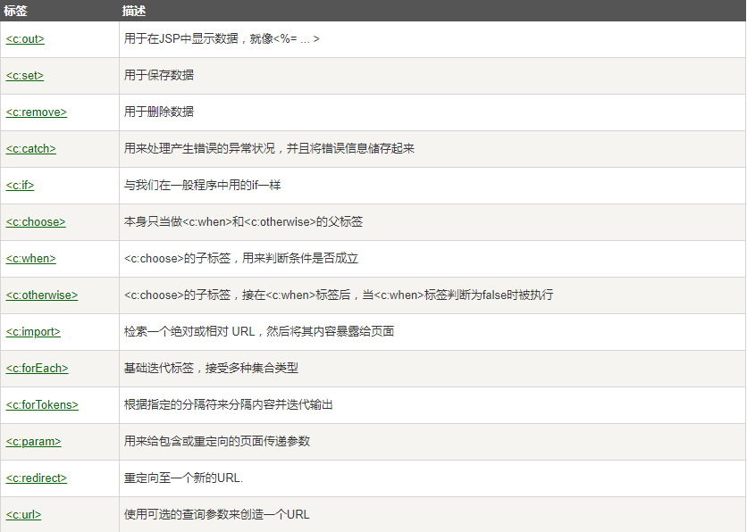
核心标签库共有14个标签，从功能上分为4类

| 标签类别       | 标签                         |      |
| -------------- | ---------------------------- | ---- |
| 表达式控制标签 | out，set，remove，catch      |      |
| 流程控制标签   | if，choose，when，otherwise  |      |
| 循环标签       | forEach，forTokens           |      |
| URL操作标签    | import，url，redirect，param |      |

**out标签的用法**  

用于在JSP中显示数据，就像<%= … >

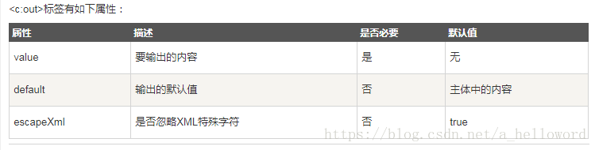


**格式化标签：**

在JSP文件开头使用如下语法

```
<%@ taglib prefix="fmt" uri="http://java.sun.com/jsp/jstl/fmt" %>
```

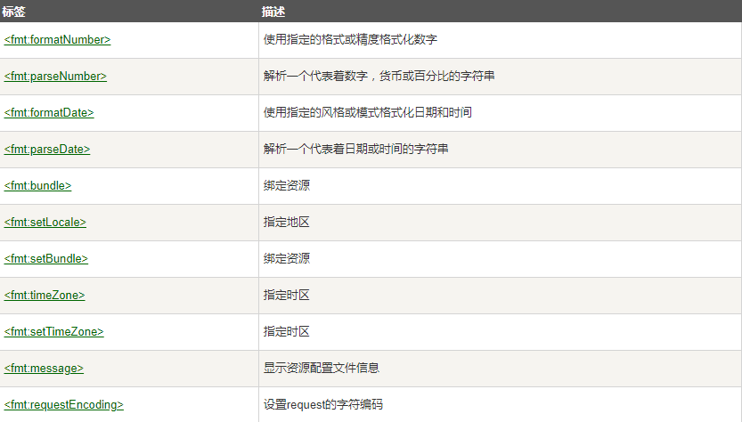

## 过滤器

## 监听器