[TOC]

# Java基础

## 1.简介

Java 是由 Sun Microsystems 公司于 1995 年 5 月推出的，由 James Gosling和同事们共同研发，后来 Sun 公司被 Oracle （甲骨文）公司收购，Java 也随之成为 Oracle 公司的产品。

**java分为三个体系：**

- JavaSE（J2SE）（Java2 Platform Standard Edition，java平台标准版）
- JavaEE(J2EE)(Java 2 Platform,Enterprise Edition，java平台企业版)
- JavaME(J2ME)(Java 2 Platform Micro Edition，java平台微型版)。

2005 年 6 月，JavaOne 大会召开，SUN 公司公开 Java SE 6。此时，Java 的各种版本已经更名，以取消其中的数字 "2"：J2EE 更名为 Java EE，J2SE 更名为Java SE，J2ME 更名为 Java ME。

------

**主要特性**

**Java 语言是简单的：**

Java 语言的语法与 C 语言和 C++ 语言很接近，使得大多数程序员很容易学习和使用。另一方面，Java 丢弃了 C++ 中很少使用的、很难理解的、令人迷惑的那些特性，如操作符重载、多继承、自动的强制类型转换。特别地，Java 语言不使用指针，而是引用。并提供了自动分配和回收内存空间，使得程序员不必为内存管理而担忧。

**Java 语言是面向对象的：**

Java 语言提供类、接口和继承等面向对象的特性，为了简单起见，只支持类之间的单继承，但支持接口之间的多继承，并支持类与接口之间的实现机制（关键字为 implements）。Java 语言全面支持动态绑定，而 C++语言只对虚函数使用动态绑定。总之，`Java语言是一个纯的面向对象程序设计语言`。

**Java 语言是健壮的：**

Java 的强类型机制、异常处理、垃圾的自动收集等是 Java 程序健壮性的重要保证。对指针的丢弃是 Java 的明智选择。Java 的安全检查机制使得 Java 更具健壮性。

**Java语言是可跨平台的：**

Java文件在运行时，会将源文通过javac命令编译为字节码文件，这个文件是跨平台的，java虚拟机（jvm，在java运行环境/jre中）也对应的只接收处理class文件，java虚拟机是一个通用的执行平台（但有不同版本），不同java平台编写文件通过java虚拟机转换的文件最后功能相同，因而实现在任意平台的java程序都可以在其他平台运行发展

------

**3.发展历史**

- `1995 年` 5 月 23 日，Java 语言诞生

- `1996 年` 1 月，第一个 JDK-JDK1.0 诞生

- 1996 年 4 月，10 个最主要的操作系统供应商申明将在其产品中嵌入 JAVA 技术

- 1996 年 9 月，约 8.3 万个网页应用了 JAVA 技术来制作

- 1997 年 2 月 18 日，JDK1.1 发布

- 1997 年 4 月 2 日，JavaOne 会议召开，参与者逾一万人，创当时全球同类会议规模之纪录

- 1997 年 9 月，JavaDeveloperConnection 社区成员超过十万

- 1998 年 2 月，JDK1.1 被下载超过 2,000,000次

- 1998 年 12 月 8 日，JAVA2 企业平台 J2EE 发布

- 1999 年 6月，SUN 公司发布 Java 的三个版本：标准版（JavaSE, 以前是 J2SE）、企业版（JavaEE 以前是 J2EE）和微型版（JavaME，以前是 J2ME）

- 2000 年 5 月 8 日，JDK1.3 发布

- 2000 年 5 月 29 日，JDK1.4 发布

- 2001 年 6 月 5 日，NOKIA 宣布，到 2003 年将出售 1 亿部支持 Java 的手机

- 2001 年 9 月 24 日，J2EE1.3 发布

- 2002 年 2 月 26 日，J2SE1.4 发布，自此 Java 的计算能力有了大幅提升

- 2004 年 9 月 30 日 18:00PM，J2SE1.5 发布，成为 Java 语言发展史上的又一里程碑。为了表示该版本的重要性，J2SE1.5 更名为 Java SE 5.0

- 2005 年 6 月，JavaOne 大会召开，SUN 公司公开 Java SE 6。此时，Java 的各种版本已经更名，以取消其中的数字 "2"：J2EE 更名为 Java EE，J2SE 更名为 Java SE，J2ME 更名为 Java ME

- `2006` 年 12 月，SUN 公司发布 JRE6.0

- `2009 年 04 月 20 日，甲骨文 74 亿美元收购 Sun，取得 Java 的版权。`

- 2010 年 11 月，由于甲骨文对于 Java 社区的不友善，因此 Apache 扬言将退出 JCP。

- 2011 年 7 月 28 日，甲骨文发布 Java7.0 的正式版。

- 2014 年 3 月 18 日，Oracle 公司发表 `Java SE 8`。

- 2017 年 9 月 21 日，Oracle 公司发表 Java SE 9

- 2018 年 3 月 21 日，Oracle 公司发表 Java SE 10

- 2018 年 9 月 25 日，Java SE 11 发布

- 2019 年 3 月 20 日，Java SE 12 发布

- #### `2021年   Java SE 16   `

------

## 2.相关概念介绍

JVM ：英文名称（Java Virtual Machine） Java 虚拟机

它只认识 xxx.class 这种类型的文件，它能够将 class 文件中的字节码指令进行识别并调用操作系统，jvm 是 Java 能够跨平台的核心

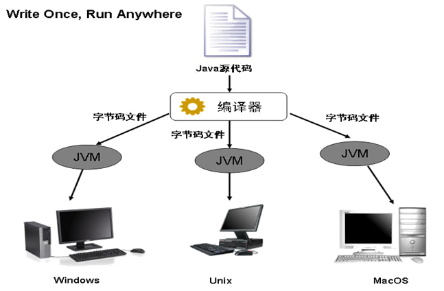

JRE ：英文名称（Java Runtime Environment）Java 运行时环境

它主要包含两个部分，jvm 的标准实现和 Java 的一些基本类库。它相对于 jvm 来说，多出来的是一部分的 Java 类库。

JDK ：英文名称（Java Development Kit）Java 开发工具包

jdk 是整个 Java 开发的核心，它集成了 jre 和一些好用的小工具。例如：javac.exe，java.exe，jar.exe 等。

显然，这三者的关系是：一层层的嵌套关系

`JDK>JRE>JVM`

## 3.开发环境的安装  JDK

>开发环境的安装请参照 《开发环境安装.md》

## 4.Java程序工具介绍

1.使用记事本开发

2.使用第三方工具   Eclipse  idea 

## 5.Java程序开发步骤

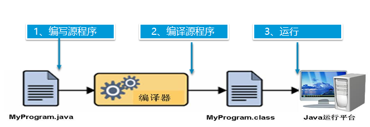

使用记事本开发第一个java程序

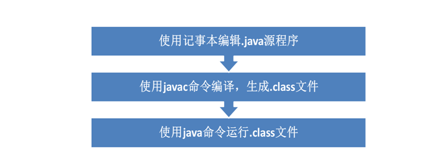

```java

public class HelloWorld{
    
    //程序的入口
    public static void main(String [] args ){
        System.out.println("hello world")
    }
    
}

/*
第一个程序解析：
先写一个class关键字  后面跟上代码的名字，理论上名字可以随便写，但是实际上要遵循一定的规则和规约，名字中可以含有如下的信息，
	1.字母（26个英文字母，大小写敏感），数字(0-9,不能用作开头)，符号(英文符号 _ $)，中文(不推荐使用)
	2.单词的首字母大写，如果两个以上的单词，每个单词的首字母都要大写
	3.最好见名知意

 public：公共的  权限修饰符
 static 静态的  只有一个
 void 返回值类型  没有返回值
 main  方法的名字
 （）参数列表 args  arguments
 
如果一个文件中写了多个类，那么文件的名字必须和文件中被public关键字修饰的类一致
*/

/*
	java编码的规范
	
	1.一行只写一条语句
	2.{}的使用及位置
	3.代码的缩进
*/


    
```

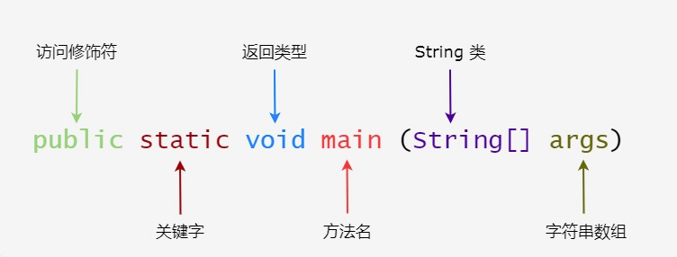

编写完成之后，使用javac编译源程序，可得到一个字节码文件

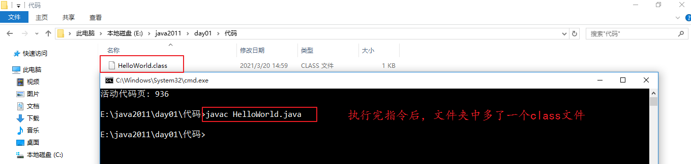


运行程序

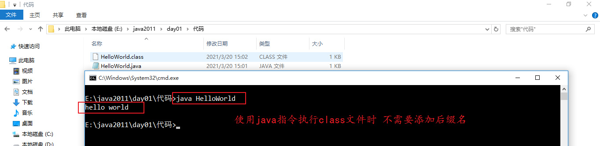

从控制台可以看出，已经将`hello world` 打印在控制台


**java中的注释**

java中的注释分为以下三种

​	1.单行注释    //

​	2.多行注释	/**/

​	3.文档注释  /**  */  使用javadoc 生成文档注释

```java
javadoc -d api -author -version Hello.java
```

**windows中常用的doc指令**

| 指令                  | 作用                           |
| --------------------- | ------------------------------ |
| dir (directory)       | 列出当前目录下的文件以及文件夹 |
| md (make directory)   | 创建目录                       |
| rd (remove directory) | 删除目录                       |
| cd (change directory) | 进入指定目录                   |
| cd..                  | 退回到上一级目录               |
| cd\                   | 退回到根目录                   |
| del                   | 删除文件                       |
| exit                  | 退出dos命令行                  |
| cls (clear screen)    | 清屏                           |

**Eclipse常用快捷方式**

Ctrl+D:删除当前行

Ctrl+Alt+↓ 复制当前行到下一行

Ctrl+Alt+↑ 复制当前行到上一行

 Alt+↓ 当前行和下面一行交互位置(特别实用,可以省去先剪切,再粘贴了)

Alt+↑ 当前行和上面一行交互位置(同上

 Shift+Enter在当前行的下一行插入空行(这时鼠标可以在当前行的任一位置,不一定是最后)

Ctrl+Shift+Enter在当前行插入空行(原理同上条)

ctrl+shift+o：自动引入包和删除无用包

ctrl+/：自动注释当前行或者选择的多行

## java中的变量

什么是变量

变量指代的是计算机中的一段内存空间，可以存放数据，可以变量名代替内存地址，将数据存入指定的内存空间

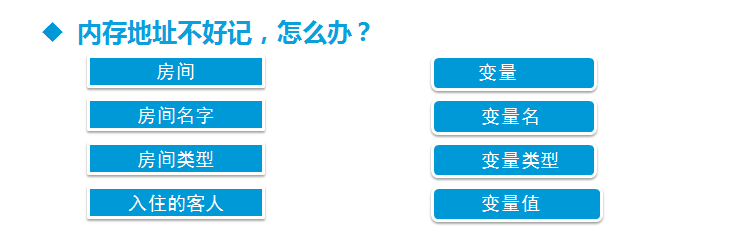

如何声明一个变量？

java中的变量是一种静态类型的变量，在声明的时候要指明存储数据的数据类型，和变量的名字

**变量的声明和使用**

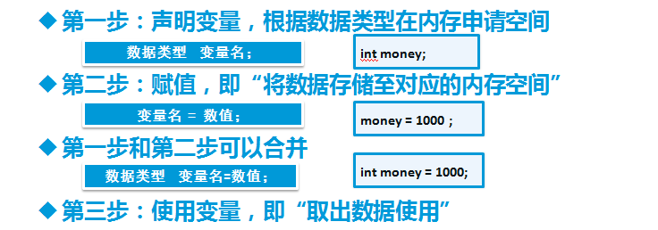

**变量名命名的规则**

​	1.变量名是数字 字母  下划线  $ 组成  中文不推荐使用

​	2.不能以数字开头

​	3.不能使用关键字和保留字

​	4.变量名字要见名知意

​	5.建议使用驼峰命名法

`类名命名规则可参考变量命名的规则`

## java数据类型

1.基本数据类型

| 数据类型 | 英文表示                              |
| -------- | ------------------------------------- |
| 整型     | byte   short   int   long             |
| 浮点型   | float    double                       |
| 字符型   | char    为了区分需要加单引号  a  +  5 |
| 布尔型   | boolean                               |

每种数据类型占的字节数

| 数据类型 | 字节数                                   |
| -------- | ---------------------------------------- |
| byte     | 1字节 8位    00000000  取值范围 -128~127 |
| short    | 2字节16位   -32768~32767                 |
| int      | 4字节                                    |
| long     | 8字节                                    |
| float    | 4字节                                    |
| double   | 8字节                                    |
| char     | 2字节                                    |
| boolean  | 1bit                                     |

2.引用数据类型

  数组  类class   接口 interface  枚举 enum   注解@interface

**案例：**

一、**使用变量完成如下操作**

​	1.输出Java课考试最高分：98.5

​	2.输出最高分学员姓名：张三

​	3.输出最高分学员性别：男

​	`提示：字符串的连接使用“+”`

二、**输出个人简历**

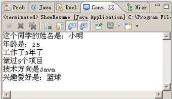


## **Scanner的使用**

**在程序运行中，如何接收用户键盘输入的值？**使用Scanner

第一步：导入Scanner类

```java
import java.util.*;
```

第二步：创建Scanner对象

```java
Scanner input = new Scanner(System.in);
```

第三步：获得键盘输入的数据

```java
int now = input.nextInt();
```

**nextInt()和nextLine()配合使用时的注意事项**

1.nextInt()读取的结果是一个int类型的数据，返回int值

2.nextFloat()读取的是一个float类型的数据，返回一个float值

3.next()读取结果为String，返回String类型

4.nextLine()读取结果为String类型，返回String类型

主要区别在回车符之间的区别

nextInt()、nextFloat()、next()看到空格符挥着回车符都认为读取结束了，此时不会读取回车符，也就是说回车符会留在这里等待下一个可以读取回车符的流来读取，nextLine也是以回车符为结束，并且只是以回车符结束，并且会读取回车符


```java
public class HelloWorld {

	public static void main(String[] args) {
		
		Scanner scanner = new Scanner(System.in);
		
		System.out.println("请输入年龄：");
		int age = scanner.nextInt();
		System.out.println("请输入姓名：");
		String name = scanner.next();
		System.out.println(name);
		System.out.println(age);	
		
	}

}
```

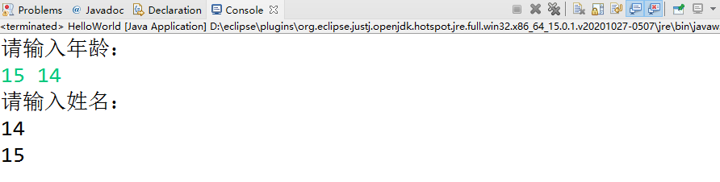

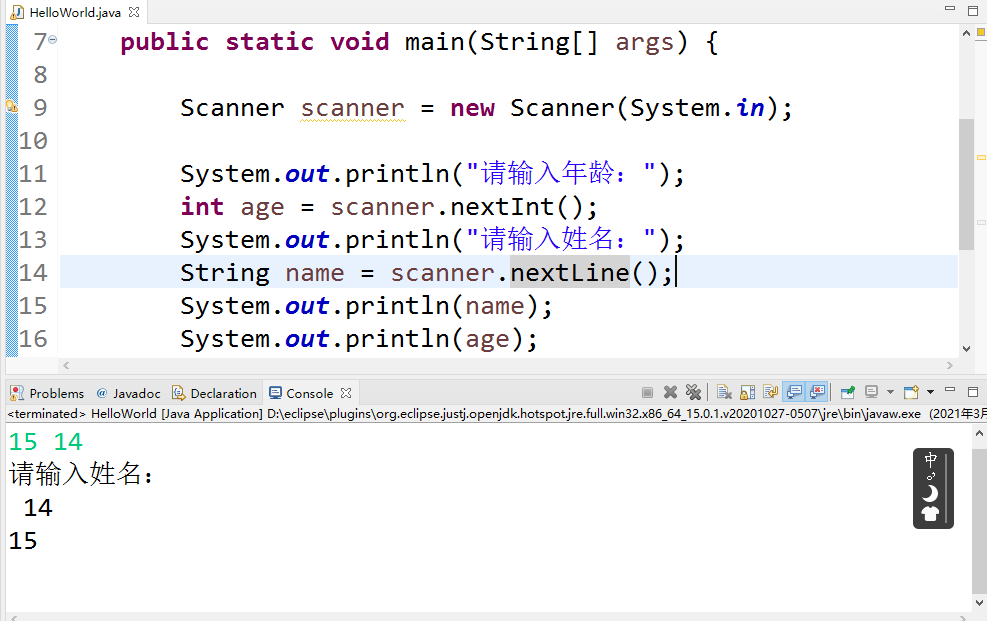

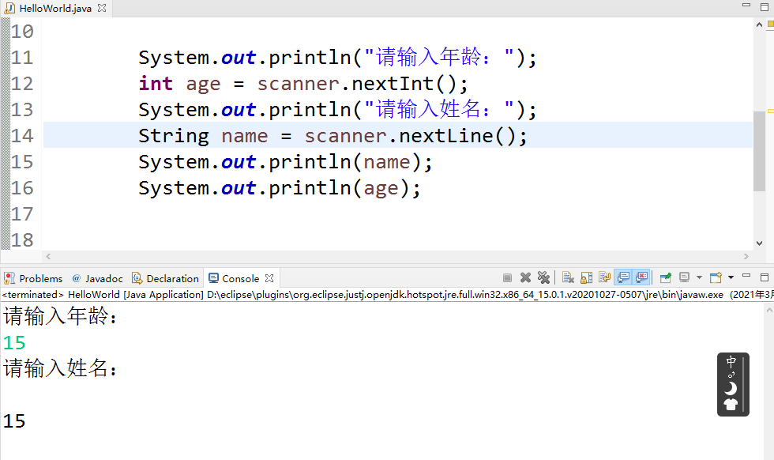


## Java数据类型转换

数据类型的转换分为 自动转换和强制转换

自动转化 也叫隐式转换

小范围到大范围 自动转换     byte -> short ->  int  ->long ->  float ->  double

char 类型和 int类型在存储范围允许的情况下可以互转 

 强制转换也叫显示转换  强制转换存在精度丢失的问题


1.byte short char 类型参与四则运算的时，会先提升为int在参与运算

2.同种类型的数值参与运算，结果还是原来的类型

3.有大范围的类型参与运算，结果为大范围的类型

4.有String类型参与的运算，结果是String类型

## Java运算符

**算术运算符**用在数学表达式中，它们的作用和在数学中的作用一样。下表列出了所有的算术运算符。

表格中的实例假设整数变量A的值为10，变量B的值为20

| 操作符 | 描述                              | 例子                               |
| :----- | :-------------------------------- | :--------------------------------- |
| +      | 加法 - 相加运算符两侧的值         | A + B 等于 30                      |
| -      | 减法 - 左操作数减去右操作数       | A – B 等于 -10                     |
| *      | 乘法 - 相乘操作符两侧的值         | A * B等于200                       |
| /      | 除法 - 左操作数除以右操作数       | B / A等于2                         |
| ％     | 取余 - 左操作数除以右操作数的余数 | B%A等于0                           |
| ++     | 自增: 操作数的值增加1             | B++ 或 ++B 等于 21（区别详见下文） |
| --     | 自减: 操作数的值减少1             | B-- 或 --B 等于 19（区别详见下文） |

```java
public class Test {
 
  public static void main(String[] args) {
     int a = 10;
     int b = 20;
     int c = 25;
     int d = 25;
     System.out.println("a + b = " + (a + b) );
     System.out.println("a - b = " + (a - b) );
     System.out.println("a * b = " + (a * b) );
     System.out.println("b / a = " + (b / a) );
     System.out.println("b % a = " + (b % a) );
     System.out.println("c % a = " + (c % a) );
     System.out.println("a++   = " +  (a++) );
     System.out.println("a--   = " +  (a--) );
     // 查看  d++ 与 ++d 的不同
     System.out.println("d++   = " +  (d++) );
     System.out.println("++d   = " +  (++d) );
  }
}
```

**关系运算符**

表格中的实例整数变量A的值为10，变量B的值为20

| 运算符 | 描述                                                         | 例子             |
| :----- | :----------------------------------------------------------- | :--------------- |
| ==     | 检查如果两个操作数的值是否相等，如果相等则条件为真。         | （A == B）为假。 |
| !=     | 检查如果两个操作数的值是否相等，如果值不相等则条件为真。     | (A != B) 为真。  |
| >      | 检查左操作数的值是否大于右操作数的值，如果是那么条件为真。   | （A> B）为假。   |
| <      | 检查左操作数的值是否小于右操作数的值，如果是那么条件为真。   | （A <B）为真。   |
| >=     | 检查左操作数的值是否大于或等于右操作数的值，如果是那么条件为真。 | （A> = B）为假。 |
| <=     | 检查左操作数的值是否小于或等于右操作数的值，如果是那么条件为真。 | （A <= B）为真。 |

```java
public class Test {
 
  public static void main(String[] args) {
     int a = 10;
     int b = 20;
     System.out.println("a == b = " + (a == b) );
     System.out.println("a != b = " + (a != b) );
     System.out.println("a > b = " + (a > b) );
     System.out.println("a < b = " + (a < b) );
     System.out.println("b >= a = " + (b >= a) );
     System.out.println("b <= a = " + (b <= a) );
  }
}
```

**位运算符**

下表列出了位运算符的基本运算，假设整数变量 A 的值为 60 和变量 B 的值为 13

| 操作符 | 描述                                                         | 例子                           |
| :----- | :----------------------------------------------------------- | :----------------------------- |
| ＆     | 如果相对应位都是1，则结果为1，否则为0                        | （A＆B），得到12，即0000 1100  |
| \|     | 如果相对应位都是 0，则结果为 0，否则为 1                     | （A \| B）得到61，即 0011 1101 |
| ^      | 如果相对应位值相同，则结果为0，否则为1                       | （A ^ B）得到49，即 0011 0001  |
| 〜     | 按位取反运算符翻转操作数的每一位，即0变成1，1变成0。         | （〜A）得到-61，即1100 0011    |
| <<     | 按位左移运算符。左操作数按位左移右操作数指定的位数。         | A << 2得到240，即 1111 0000    |
| >>     | 按位右移运算符。左操作数按位右移右操作数指定的位数。         | A >> 2得到15即 1111            |
| >>>    | 按位右移补零操作符。左操作数的值按右操作数指定的位数右移，移动得到的空位以零填充。 | A>>>2得到15即0000 1111         |

```
A = 0011 1100
B = 0000 1101
-----------------
A&B = 0000 1100
A | B = 0011 1101
A ^ B = 0011 0001
~A= 1100 0011
```

**逻辑运算符**

下表列出了逻辑运算符的基本运算，假设布尔变量A为真，变量B为假

| 操作符 | 描述                                                         | 例子                |
| :----- | :----------------------------------------------------------- | :------------------ |
| &&     | 称为逻辑与运算符。当且仅当两个操作数都为真，条件才为真。     | （A && B）为假。    |
| \| \|  | 称为逻辑或操作符。如果任何两个操作数任何一个为真，条件为真。 | （A \| \| B）为真。 |
| ！     | 称为逻辑非运算符。用来反转操作数的逻辑状态。如果条件为true，则逻辑非运算符将得到false。 | ！（A && B）为真。  |

```java
public class Test {
  public static void main(String[] args) {
     boolean a = true;
     boolean b = false;
     System.out.println("a && b = " + (a&&b));
     System.out.println("a || b = " + (a||b) );
     System.out.println("!(a && b) = " + !(a && b));
  }
}


int x=8;
int y=9;
System.out.println((++x==y)&&(++x!=y)); //true
System.out.println(x);//10


int x=8;
int y=9;
System.out.println( (++x!=y)&&(++x==y)); // false
System.out.println(x); //9

```

**短路逻辑运算符**
当使用与逻辑运算符时，在两个操作数都为true时，结果才为true，但是当得到第一个操作为false时，其结果就必定是false，这时候就不会再判断第二个操作了。

```java
public class LuoJi{
    public static void main(String[] args){
        int a = 5;//定义一个变量；
        boolean b = (a<4)&&(a++<10);
        System.out.println("使用短路逻辑运算符的结果为"+b);
        System.out.println("a的结果为"+a);
    }
}
```

**运行结果为：**

使用短路逻辑运算符的结果为false,a的结果为5
**赋值运算符**
下面是Java语言支持的赋值运算符：

| 操作符  | 描述                                                         | 例子                                     |
| :------ | :----------------------------------------------------------- | :--------------------------------------- |
| =       | 简单的赋值运算符，将右操作数的值赋给左侧操作数               | C = A + B将把A + B得到的值赋给C          |
| + =     | 加和赋值操作符，它把左操作数和右操作数相加赋值给左操作数     | C + = A等价于C = C + A                   |
| - =     | 减和赋值操作符，它把左操作数和右操作数相减赋值给左操作数     | C - = A等价于C = C - A                   |
| * =     | 乘和赋值操作符，它把左操作数和右操作数相乘赋值给左操作数     | C * = A等价于C = C * A                   |
| / =     | 除和赋值操作符，它把左操作数和右操作数相除赋值给左操作数     | C / = A，C 与 A 同类型时等价于 C = C / A |
| （％）= | 取模和赋值操作符，它把左操作数和右操作数取模后赋值给左操作数 | C％= A等价于C = C％A                     |
| << =    | 左移位赋值运算符                                             | C << = 2等价于C = C << 2                 |
| >> =    | 右移位赋值运算符                                             | C >> = 2等价于C = C >> 2                 |
| ＆=     | 按位与赋值运算符                                             | C＆= 2等价于C = C＆2                     |
| ^ =     | 按位异或赋值操作符                                           | C ^ = 2等价于C = C ^ 2                   |
| \| =    | 按位或赋值操作符                                             | C \| = 2等价于C = C \| 2                 |

**条件运算符**也被称为三元运算符。该运算符有3个操作数，并且需要判断布尔表达式的值。该运算符的主要是决定哪个值应该赋值给变量。

```java
variable x = (expression) ? value if true : value if false
```

## **Java流程控制**

**1.流程控制的分类**

- ​		顺序结构

  ​		代码自上而下依次执行，所有的代码都会被执行

- ​		选择结构

  ​		依据不同的条件选择不同的执行路径

- ​		循环结构

  ​		循环执行同样或类似的操作，达到对应的条件结束循环

**2.流程控制符号**

​	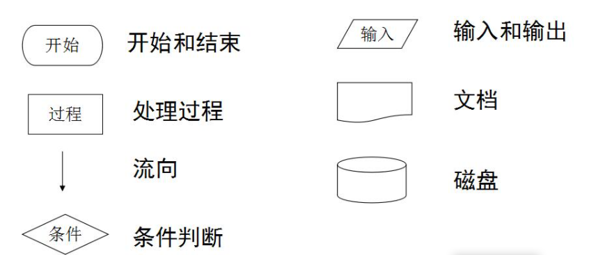


**流程控制示意图**

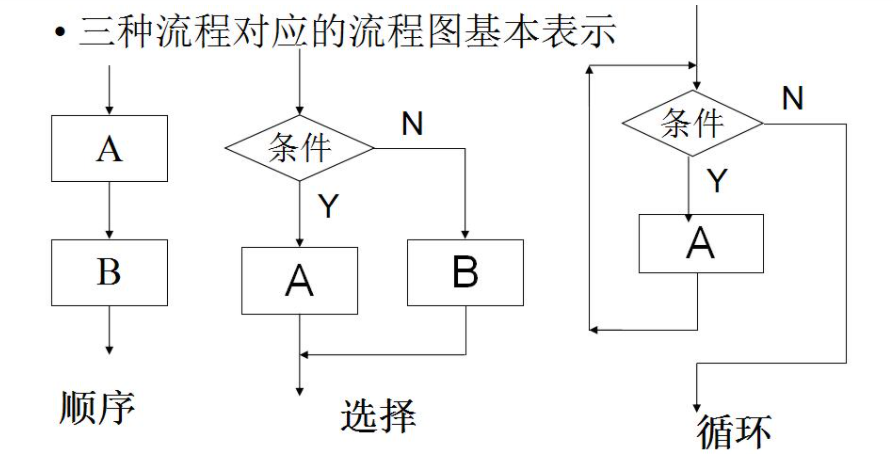

**3.流程控制的语法**

1.分支结构

​	单分支

```java
if(条件表达式){
    //满足条件执行括号内部的代码
}
```

​	双分支

```java
if(条件表达式){
     //满足条件执行该括号内部的代码
}else{
    //不满足条件执行该括号内部的代码
}
```

​	多分支

```java
if(条件表达式1){
     //满足条件执行括号内部的代码
}else if(条件表达式2){
     //满足条件执行括号内部的代码
}else if(条件表达式3){
     //满足条件执行括号内部的代码
}....
 else{
    //不满足条件执行该括号内部的代码 
}


//多分支 也可以使用switch case结构 支持的类型  byte short int char  String  Enum
    switch(变量){
         
        case  值1：
            代码块1
            break;
        case  值2：
            代码块2
            break;
        case  值3：
            代码块3
            break;
            ......
        default：
           代码块n   
    }
/*
    基本数据类型：int，byte，short，char
    基本数据类型封装类：Integer，Byte，Short，Character
    枚举类型：Enum（JDK 5+开始支持）
    字符串类型：String（JDK 7+ 开始支持）
*/
    
```

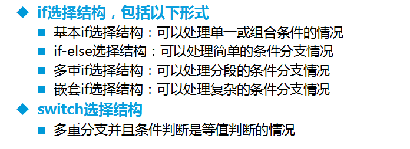

**案例**

1.出租车，起步价(2公里以内)为7元，超过2公里的按照每公里3元计算。要求根据路程计算费用

2.判断闰年（闰年的条件是能被4整除，但不能被100整除；或能被400整除。）

3.根据性别和体重计算输血量。女性体重不超过50kg的输血量为200毫升，否则250毫升；男性不超过60kg的输血量为250毫升，否则300毫升

4.当气温高于26℃时，需要开启制冷空调；气温低于10℃则开启制热空调；其余情况只需要开启送风模式即可。编制自动温控程序，控制操作用输出相应的提示字符串来模拟，比如“开启制冷“

5.根据《省电网销售电价表》，居民生活用电按3个梯度收费：月用电量150千瓦时及以下部分，每千瓦时0.4463元，151—400千瓦时部分为0.4663元，401千瓦时以上部分为0.5663元，请编写程序，当输入用户的用电量时，计算出所需付的费用

6.假设从A地到B地的火车票有硬座和硬卧，价格分别为100和190元。根据铁路部门规定，未成年人(18周岁以下)身高不足120cm免票，120(含)-150(不含)cm需半票，150及以上的需全票，未成年人卧铺只能减免硬座的半价。请设计一个购票程序，要求输入年龄和身高(未成人需要输入)以及票的类型，输出票的价

7.输出两个数字之间的最大数

------

2.循环结构

​	for循环

```java
for(表达式1;表达式2;表达式3){
    //循环执行的代码
}

/*
	表达式1  初始化计数器  
	表达式2  循环执行的条件 满足执行 不满足 循环终止  
	表达式3  改变计数器的值
*/

```

while循环

```java
while(条件表达式){
     //循环执行的代码
}
//当条件为true时  继续执行括号内的代码块 否则终止
```

​	do ...while循环

```java
do{
   //循环执行的代码  
}while(条件表达式)
```

**案例**

1.打印图形


2.打印
 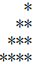

3.甲乙丙丁加工零件，加工的总数是370， 如果甲加工的零件数多10，如果乙加工的零件数少20
如果丙加工的零件数乘以2，如果丁加工的零件数除以2，四个人的加工数量相等，求甲乙丙丁各自加工多少个零件

4.鸡兔同笼  一共50只 ，脚160 ，求鸡多少只 ，兔子多少只！

5.输出100以内的素数，素数是只能被1和自身整除的数

6.输出20以内的偶数和奇数的个数

7.输出1000以内的水仙花数，
例子：如果一个三位数 abc=axaxa+bxbxb+cxcxc 则该数字是一个水仙花数

8.分别计算1到100的偶数和奇数和

9.打印9*9乘法表

10.输入五个学生的成绩，计算总成绩，以及平均成绩

11.打印指定行和列的矩形，矩形由*组成

------

## Java数组

为什么要使用数组

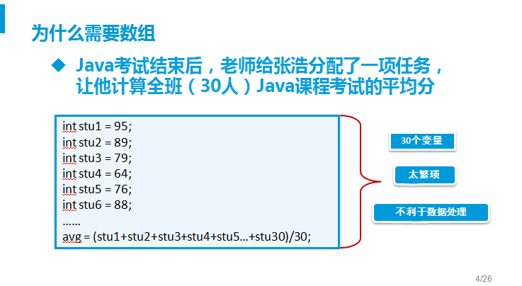

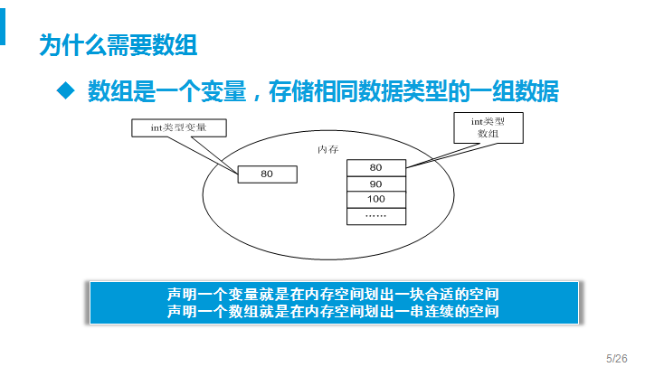

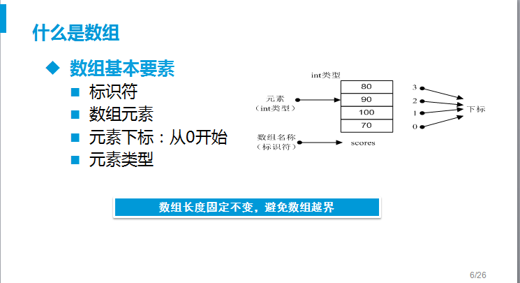


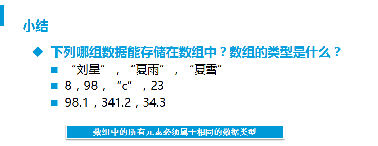

**数组创建方式**

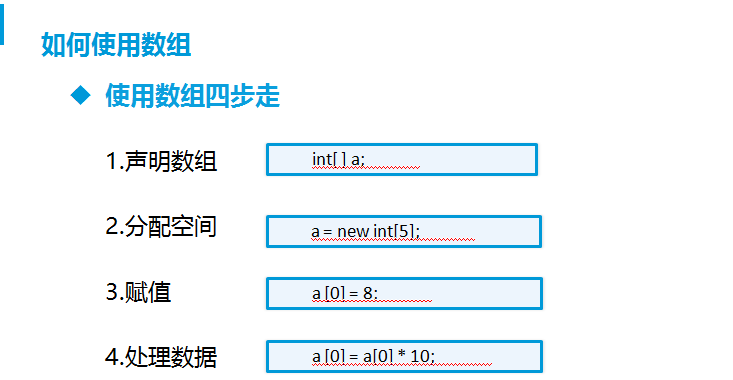


1.数组一旦声明，数组中存放的数据类型已经确定

2.数组一旦划分空间，数组的容量就确定了，使用数组不能越界

3.数组的索引从0开始，数组的最大索引是容量减一

4.数组在内容中划分的空间是连续的


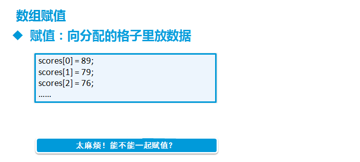

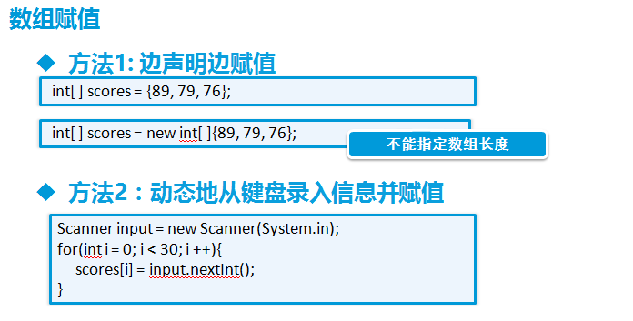

**数组遍历**

三种循环结构和增强for循环

**for  VS foreach：**

1.普通的for循环可以拿到循环的索引，foreach不能

2.for循环可以改变数组元素的值，foreach不能

**数组排序**

1.冒泡排序（Bubble Sort）
冒泡排序是一种简单的排序算法。它重复地走访过要排序的数列，一次比较两个元素，如果它们的顺序错误就把它们交换过来。比较相邻的元素如果第一个比第二个大，就交换它们两个。

**动图演示**


2，选择排序（Selection Sort）
选择排序（选择排序）是一种简单直观的排序算法它的工作原理：首先在未排序序列中找到最小（大）元素，存放到排序序列的起始位置，然后，再从剩余未排序元素中继续寻找最小（大）元素，然后放到已排序序列的末尾。以此类推，直到所有元素均排序完毕。 

**动图演示**


3，插入排序（Insertion Sort）
插入排序（插入分页）的算法描述是一种简单直观的排序算法。它的工作原理是通过构建有序序列，对于未排序数据，在已排序序列中从后向前扫描，找到相应位置并插入。
**动图演示**


**数组自动扩容**

```java
for (int i = 0; i < 10; i++) {
    if(i>nums.length-1) {
        //创建新的数组  比原来的始祖容量大1
        int[] temp= new int[nums.length+1];
        for (int j = 0; j < nums.length; j++) {
            temp[j] = nums[j];
        }
        nums = temp;
    }
    nums[i]= scanner.nextInt();
}
```

**Arrays工具类的使用**

1.toString 将数组转换成字符串打印

2.sort数组的排序，基本类型使用快排方法 ，引用 类型使用的并归排序

3.binarySearch（目标数组，元素）查找指定元素在指定数组的位置，找不到返回负数

`注意：二分查找一定要先排序，而且是排升序`

4.copyOf(原数组，新长度) 如果新的长度比原数组小，则会舍去后面的元素，如果大则自动补全默认值

5.fill(目标数组,指定值)快速的填充数组

6.equals(array1, array2) 比较数组是否相等

7.Arrays的扩展方法 stream

```java
//遍历数组
Arrays.stream(array).forEach(x->System.out.println(x))  
//遍历的同时改变数组元素
 Arrays.stream(array).forEach(x->{
    x+=10;
  System.out.println(x)  
}) 
//过滤
Arrays.stream(array).filter(x->x>=5).forEach(x->System.out.println(x));
//计数
long count = Arrays.stream(array).filter(x->x>5).count();
```

**二维数组**（会用即可）

二维数组中的每一个元素是一个一维数组，一维数组中的元素是数据内容

语法格式：

数据类型[ 行数] ] [列数 ]    

------

## 面向对象

**整体介绍目标**：

- [ ] 会创建类和对象
- [ ] 掌握面向对象的三大特性：封装、继承、多态
- [ ] 掌握抽象类和接口的使用
- [ ] 掌握程序中的异常处理
- [ ] 会使用面向对象思想进行编程

### **类和对象的关系**

分类是人们认识世界的一个很自然的过程，在日常生活中会不自觉地进行分类，Java 是面向对象的编程语言，对象是面向对象程序设计的核心。所谓对象就是真实世界中的实体，对象与实体是一一对应的，也就是说现实世界中每一个实体都是一个对象，它是一种具体的概念。
对象具有属性和行为，一切皆为对象，真实世界中的所有事物都可以视为对象。

例如，在真实世界的学校里，会有学生和老师等实体，学生有学号、姓名、所在班级等属性（数据），学生还有学习、提问、吃饭和走路等操作。学生只是抽象的描述，这个抽象的描述称为“类”。在学校里活动的是学生个体，即张同学、李同学等，这些具体的个体称为“对象”，“对象”也称为“实例”。


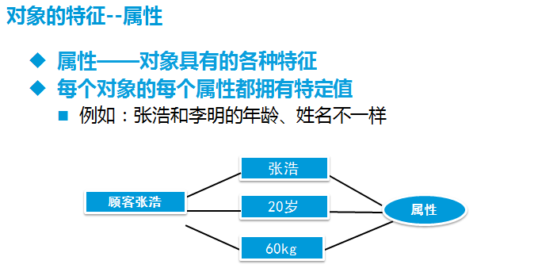

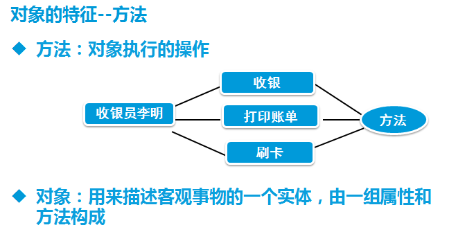

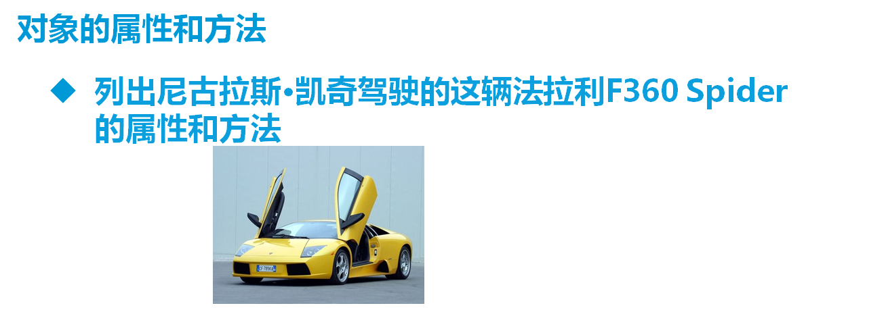


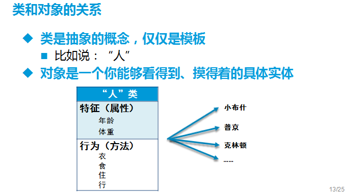

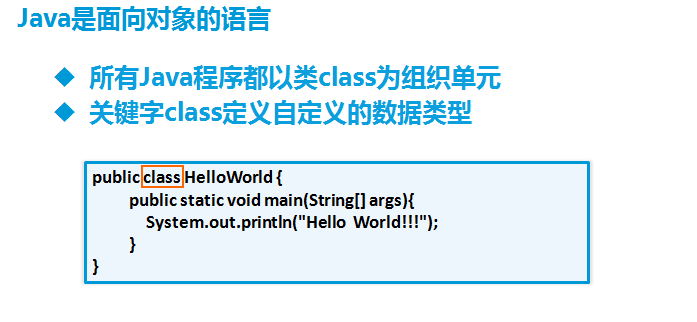


**定义类**

**定义类的步骤：**

1.定义类名

2.编写类的属性

3.编写类的方法

语法：

```java
class 类名称{
	权限修饰符 属性类型 属性名称;
	权限修饰符 返回值类型 方法名称(){}
}
```

**定义对象**

语法：一个类要想真正的进行操作，则必须依靠对象

类名称 对象名称 = new 类名称() 

**定义和调用方法**

如果要想访问类中的属性或方法（方法的定义），则可以依靠以下的语法形式：
访问类中的属性：对象.属性 
调用类中的方法：对象.方法()

**案例**

1.编写学员类，输出学员相关信息

2.编写教员类，输出教员相关信息


**通过前面案例，请思考：方法是什么？**

方法是个“黑匣子”，完成某个特定的应用程序功能，并返回结果

**请回忆：如何定义一个方法？**

```java
public   返回值类型  方法名()  {
      //这里编写方法的主体
}

public void show(){
       System.out.println("姓名：" + name + "，密码：" + password);
}

```

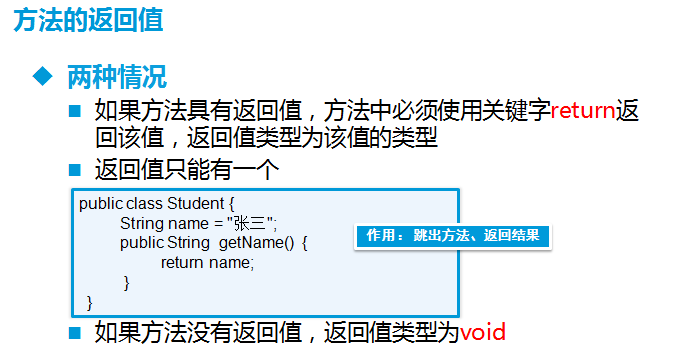

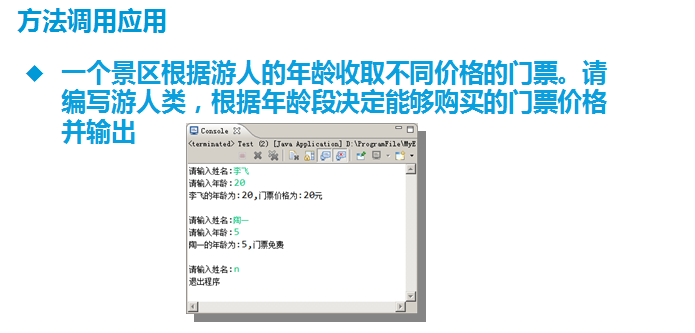

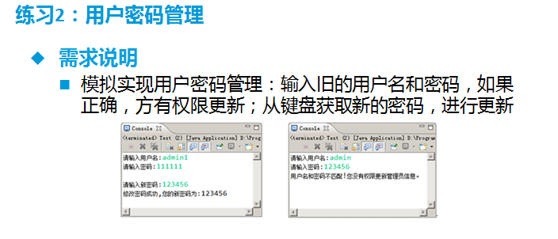

### 方法和方法的重载

**目标：**

- [ ] 方法的参数传递
- [ ] 会使用构造方法
- [ ] 掌握方法重载
- [ ] 会使用成员变量和局部变量


**如何使用带参数的方法**

**定义带参数的方法**

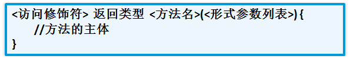

**调用带参数的方法**


**案例**

**使用带参方法实现学员信息管理**

1. 增加学员姓名
2. 在保存了多个学生姓名的数组中，指定查找区间，查找某个学生姓名并显示是否查找成

**方法重载**

- 同一个类中
- 方法名相同
- 参数个数或类型不同
- 与返回值、访问修饰符无关 

**案例**

实现简易计算器，分别实现两个整数、三个浮点数的加法运算


**构造函数**

语法:

```java
访问修饰符   构造方法名 ( ) { 
       //初始化代码
}

1.无返回值类型
2.方法名和类名相同
3.可以指定参数
    
1、与类同名，不含返回类型。如果类中没有无参的构造方法，系统会给出默认的无参构造方法。

2、构造方法一般都是public 的

3、无参构造在给对象属性赋值时比较麻烦，引出带参构造方法。

4、构造方法经常 用于程序初始化工作，在创建对象的同时赋值

5、当类有了带参构造方法之后，系统不再自动生成默认的无参构造方法，若使用需重新定义

6、构造方法只能用于创建对象时，不能在程序中像调用其他方法一样调用它，但是可以用this()的形式在其他构造方法中调用它，注意this()必须在第一行。
```

**作用**

1.对象初始化

**构造方法的重载**

1.自定义构造方法    `此时系统不再提供默认无参构造方法 `

- 方法名相同
- 参数项不同
- 与返回值、访问修饰符无关

```java
public Student(){}
	public Student(String name,int age){
    	this.name=name;
    	this.age=age;
	}
}
//带参构造方法this关键字 是对一个对象的默认引用这里用以区分同名成员变量
```

**this关键字的用法**

1. 调用属性

   ```java
   this.health = 100; 
   this.name = "大黄";
   ```

2. 调用方法

   ```java
   this.print(); 
   ```

3. 调用构造方法

```java
this();
this("小黑",100,100,"雄");

//如果使用，必须是构造方法中的第一条语句 
```

**作用域**

**成员变量和局部变量**

- 变量声明的位置决定变量作用域
- 变量作用域确定可在程序中按变量名访问该变量的区域

```java
for(int  a = 0; a < 4; a++) {
     System.out.println ("hello" );
}
System.out.println ( a );


public class Test {
     int score1 = 88;
     int score2 = 98;
      public void calcAvg() {
          int avg = (score1 + score2)/2;
      }    
      public void showAvg(){
         System.out.println("平均分是： " + avg);
     }
}
```

**成员变量和局部变量的区别**

**作用域不同**

- 局部变量的作用域仅限于定义它的方法
- 成员变量的作用域在整个类内部都是可见的

**初始值不同**

- Java会给成员变量一个初始值
- Java不会给局部变量赋予初始值

在同一个方法中，不允许有同名局部变量,在不同的方法中，可以有同名局部变量,在同一个类中，成员变量和局部变量同名时，局部变量具有更高的优先级

```java
public class Test {
        public int num;
        public void calc(int num,int num2){
               System.out.println(num+num2);
        }
        public static void main(String[] args) {
               Test test = new Test();
                test.num=10;
                test.calc(11,3);
        }
}

```

### 封装与继承

------

**本课目标**

- [ ] 理解封装的作用
- [ ] 会使用封装
- [ ] 会使用Java中的包组织类
- [ ] 掌握访问修饰符，理解访问权限

**为什么要使用封装**

不使用封装，类中的属性可以使用对象名.属性名的形式访问和赋值，无法确保赋值的合理性，为了提高赋值的合理性，可以将类中的属性隐藏，也就是封装。

**封装的概念**

将类的某些信息隐藏在类内部，不允许外部程序直接访问，而是通过该类提供的方法来实现对隐藏信息的操作和访问

**封装的两个大致原则**

- 把尽可能多的东西藏起来，对外提供便捷的接口
- 把所有的属性藏起来

**封装步骤**

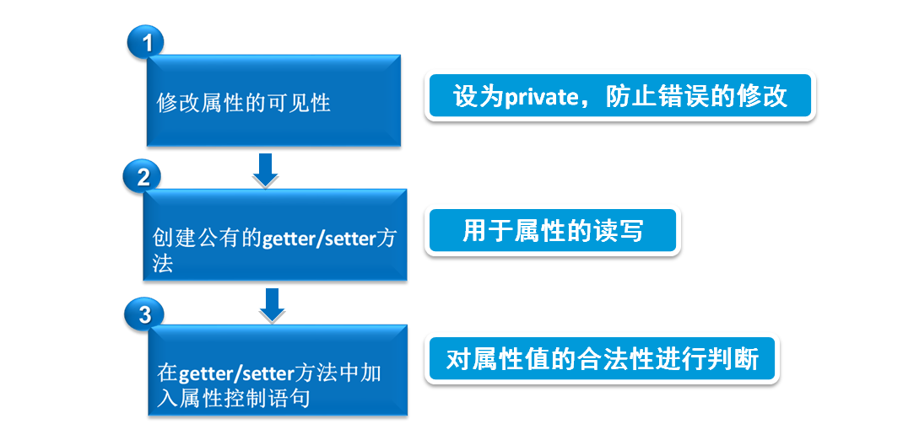

**封装的好处**

1. 便于使用者正确使用系统，防止错误修改属性
2. 有助于系统之间的松耦合，提高系统独立性
3. 提高软件的可重用性
4. 降低了构建大型系统的风险

案例：使用封装保证人类中，年龄在1-100岁之间，超出范围设置为默认值20，保证身高在150-220之间，不在范围内设置为默认值170，保证性别为男或者女，否则设置默认值为男。

------

**包的作用**

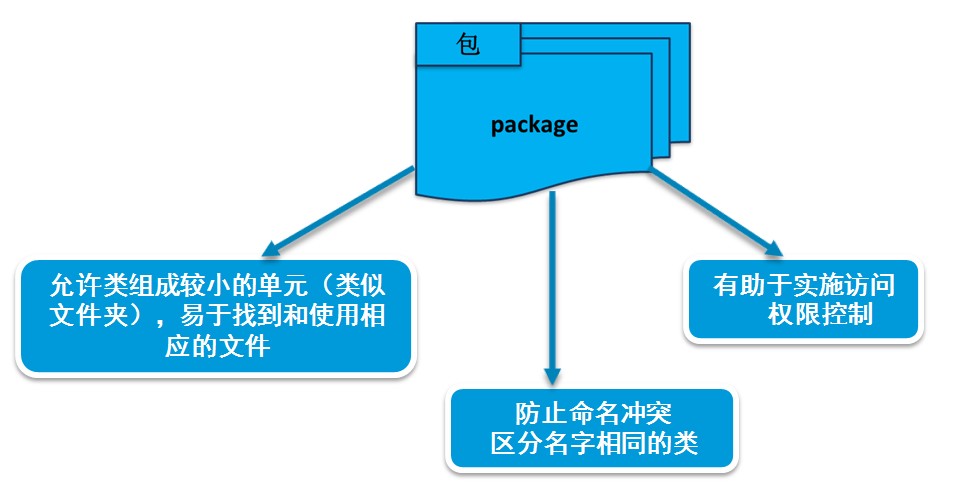

**如何创建包**

1. 作为Java源代码第一条语句          
2. 用package声明包，以分号结尾

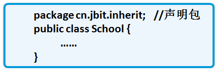

**包命名规范**

1. 包名由小写字母组成，不能以圆点开头或结尾

2. 包名之前最好加上唯一的前缀，通常使用组织倒置的网络域名

3. 包名后续部分依不同机构内部的规范不同而不同

**如何导入包**

为了使用不在同一包中的类，需要在Java程序中使用import关键字导入这个类，import   包名. 类名；

```java
import java.util.*;   //导入java.util包中所有类

import cn.jtest.classandobject.School;  //导入指定包中指定类
```

**使用包的注意事项**

- 一个类同时引用了两个来自不同包的同名类
- 必须通过完整类名来区分
- package和import的顺序是固定的
- package必须位于第一行（忽略注释行）
- 只允许有一个package语句
- 其次是import
- 接着是类的声明

------

**static关键字**

1.静态变量

​	     成员变量（类里面 方法之外）

​		1.静态变量  有static修饰     属于类本身   存储在方法区     只有一份   通过类名访问

​		2.实例变量 没有static修饰   属于对象      存储在堆里面      多份     对象名访问

```java
class Aoo{
    int a;  //实例变量
    static int b; //静态变量
    
    Aoo(){
        a++;
        b++;
    }
}
```


2.静态方法

​	1.静态的方法由static修饰

​	2.属于类本身  存储在方法区  只有一份

​	3.通常使用类名.方法名访问

​	4.静态方法没有隐式的this传递

```java
class Boo{
    int a;
    static int b;
    public void show(){
        System.out.println(a); //this.a
        System.out.println(b);Boo.b
    }
    public static void test(){ //类名访问
        System.out.println(a);
        System.out.println(b); //默认Foo.b
    }
}
```


3.静态代码块

​	1.属于类本身

​    2.类加载时会被自动执行  

​    3.只被执行一次

​    4.多个静态代码块  谁在前先执行谁


**内存管理**

1.堆  ：				存在new出来的对象    实例变量

2.栈： 				存放所有的局部变量 和 方法的参数

3.方法区：      class字节码文件 以及类中的方法和 静态变量


------

**访问权限控制**

- 类的访问控制 只能是 public 和 默认的 
- 类成员的访问控制   以下四种都可以

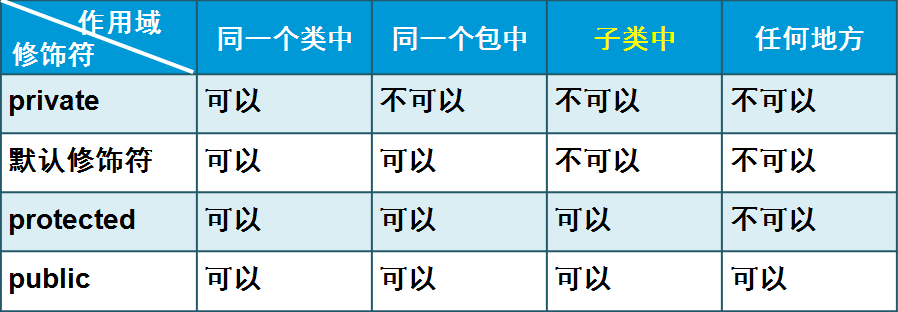

**访问权限修饰符演示代码**

```java
public class AOO {
	
	public int a; //任何类
	protected int b; // 本类 同包类 子类 
	int c;			//本类 同包类
	private int d;  //本类
	
	
	void show() {
		a = 1;
		b = 2;
		c = 3;
		d = 4;
		
	}
}

class Boo{
	void show() {
		AOO aoo = new AOO();
		aoo.a = 1;
		aoo.b = 2;
		aoo.c = 3;
		//aoo.d = 4; //private 只能在本类中访问
		
	}
}

```

```java
public class Coo {//演示同包

	public static void main(String[] args) {
		AOO aoo = new AOO();
		aoo.a = 1;
		//aoo.b = 2;
		//aoo.c = 3;
		//aoo.d = 4;
	}

}

class Doo extends AOO{ //演示派生类
	
	void show() {
		a = 1;
		b= 2;
		//c = 3;
		//d = 4;
	}
	
}
```

**继承和super**

1.代码的复用

2.通过extends实现继承

3.超类中放的是派生类中共有属性和方法  派生类中存放的是特有的方法和属性

4.派生类继承超类后，派生类具有 派生类+超类

5.一个超类可以有多个派生类    一个类只能有一个超类  单继承

6.继承具有传递性

7.java规定构造派生类之前，必须先构造超类，如果在派生类的构造方法中没有调用父类的构造方法，则默认调用super（）

案例

```java
public class Student {

	public int age;
	public String name;
	public String address;
	public String stuId;

	public void eat() {}
	public void sleep() {}
	public void study() {}
}
 class Teacher {

	public int age;
	public String name;
	public String address;
	public double salary;

	public void eat() {}
	public void sleep() {}
	public void teach() {}
}

class Doctor {

	public int age;
	public String name;
	public String address;
	public String  Level;

	public void eat() {}
	public void sleep() {}
	public void cut() {}
}
```

使用继承解决以上代码重复   extends

**super关键字**

1.super.成员变量  调用超类的成员变量

2.super.方法名    调用超类的方法  `方法的重载时讲解该用法`

3.super()  调用超类的构造方    必须在派生类的第一行

------

**final关键字**  `应用率低`

最终的，不能改变的

1.修饰变量   变量不能被修改

​	final修饰成员变量，必须在如下两种方式中初始化

​	1.在声明的同时初始化

​	2.在构造方法中初始化

```java
class Eoo{
    final int a = 3;
    final int b ;
    
    public  Eoo(){
        b = 3;
    }
    
    void show(){
        final int c;
        //a = 10;
    }
}
```

  final修饰局部变量，在使用之前初始化即可

2.修饰方法   方法不能被重写

```java
class Eoo{
   final void show(){}
}

class Foo extends Eoo{
    
   // void show ()  final 修饰的类不能被重写
}
```

3.修饰类       类不能被继承

```java
public final class Father {
	
	public  int pub;
	protected int pro;
	int defaul;
	private int priv;

}
public class Son extends Father {
    //报错
}


```

### 重写和多态 

**重写**

**什么是方法重写**

方法的重写或方法的覆盖（overriding）

- 子类根据需求对从父类继承的方法进行重新编写
- 重写时，可以用super.方法的方式来保留父类的方法
- 构造方法不能被重写

**方法重写规则**

- 方法名相同
- 参数列表相同
- 返回值类型相同或者是其子类
- 访问权限不能严于父类
- 父类的静态方法不能被子类覆盖为非静态方法,父类的非静态方法不能被子类覆盖为静态方法
- 子类可以定义与父类同名的静态方法，以便在子类中隐藏父类的静态方法(注：静态方法中无法使用super)
- 父类的私有方法不能被子类覆盖
- 不能抛出比父类方法更多的异常

**方法重写vs方法重载**

| **比较项**   | **位置** | **方法名** | **参数表** | **返回值**         | **访问修饰符**       |
| ------------ | -------- | ---------- | ---------- | ------------------ | -------------------- |
| **方法重写** | **子类** | **相同**   | **相同**   | **相同或是其子类** | **不能比父类更严格** |
| **方法重载** | **同类** | **相同**   | **不相同** | **无关**           | **无关**             |

**Object类**

Object类被子类经常重写的方法

| **方法**       | **说明**                                       |
| -------------- | ---------------------------------------------- |
| **toString()** | 返回当前对象本身的有关信息，按字符串对象返回   |
| **equals()**   | 比较两个对象是否是同一个对象**，**是则返回true |
| **hashCode()** | 返回该对象的哈希代码值                         |
| **getClass()** | 获取当前对象所属的类信息，返回Class对象        |

**多态**

所谓多态，就是指一个引用（类型）在不同的情况下的多种状态。也可以理解为，多态是指通过指向父类的指针，来调用在不同子类中实现的方法

1.超类的引用指向派生类的对象

2.能点出来什么，看引用类型

```java
class Aoo{
    int a;
    void show(){}
}

class Boo extends Aoo{
    int b;
    void test(){}
}


public class Test{
    
    public static void main(String[] args){
        Aoo aoo = new Aoo();
        aoo.a = 1;
        aoo.show;
        //aoo.b  错误  超类不能访问子类的属性和方法
        Boo boo = new Boo();
        	boo.a //正确  派生类可以访问超类 
        	boo.b
            boo.show();
        	boo.test();
        Aoo aoo = new Boo();
            aoo.a = 1;
            aoo.show;
            //aoo.b 
    }
}
```

**应用实例**

```java
public class Person {

	public void feed(Animal animal,Food food) {
		animal.cry();
		animal.eat(food);
	}
//	public void feed(Cat cat) {
//		cat.cry();
//		cat.eat();
//	}
//	public void feed(Dog dog) {
//		dog.cry();
//		dog.eat();
//	}
	
    public static void main(String[] args) {

        Person person = new Person();
        Cat cat = new Cat();
        Dog dog = new Dog();
        Food food = new Food();
        food.name = "小鱼";
        person.feed(cat, food);
        person.feed(dog,food);
    }
}
```


```java
public class Cat extends Animal{

	
	public void eat(Food food) {
		System.out.println("小猫吃"+food.name);
	}
	
	public void cry() {
		System.out.println("喵喵");
	}
	
}

public class Dog extends Animal{

	
	public void eat() {
		System.out.println("小狗吃猫粮");
	}
	
	public void cry() {
		System.out.println("汪汪");
	}
}


public class Animal {
	public int age;
	public String name;
	
	public int getAge() {
		return age;
	}
	public void setAge(int age) {
		this.age = age;
	}
	public String getName() {
		return name;
	}
	public void setName(String name) {
		this.name = name;
	}
	public void eat(Food food) {
		System.out.println("不知道吃什么");
	}
	
	public void cry() {
		System.out.println("不知道怎么叫");
	}

}
```

```java
public class Food {
	public String name;
}

public class Fish extends Food {

}
```

### **抽象类和接口**

目标：

- 了解抽象类和普通类的区别
- 会使用抽象类      `重点`
- 会定义抽象方法
- 会定义接口          `重点`
- 会运用接口解决实际问题     `重点`

**抽象类**

抽象类和抽象方法

1.抽象类  使用abstract关键字修饰的类  可以编写抽象的方法  不能创建对象

2.抽象方法  使用abstract关键字修饰的方法   不需要方法体


**抽象类与抽象方法的使用**

1. 抽象类中可以没有抽象方法，但包含了抽象方法的类必须被定义为抽象类
2. 如果子类没有实现父类的所有抽象方法，子类必须被定义为抽象类
3. 没有抽象构造方法，也没有抽象静态方法
4. 抽象类中可以有非抽象的构造方法，创建子类的实例时可能调用
5. abstract不能与final并列修饰同一个类


**接口**

在抽象类中，可以包含一个或多个抽象方法；但在接口(interface)中，所有的方法必须都是抽象的，不能有方法体，它比抽象类更加“抽象”，接口使用 `interface` 关键字来声明，可以看做是一种特殊的抽象类，可以指定一个类必须做什么，而不是规定它如何去做

**必须知道的接口特性JDK8之前**

1. 接口不可以被实例化
2. 实现类必须实现接口的所有方法
3. 实现类可以实现多个接口
4. implements、多个接口使用逗号隔开 
5. 接口中的变量都是静态常量（public static final）
6. 接口中的方法都是抽象方法（public abstract）

**JDK8新增的接口特性**

1.接口中可以定义默认的方法  default关键字 -默认方法  默认方法可以被继承

2.一个类实现了多个接口中，多个接口都定义了多个同样的默认方法

​	解决方案：

- ​	实现类重写接口中的方法
- ​    使用super来调用指定接口的方法

3.如果一个类继承了一个 抽象类，实现了一个接口，抽象类和接口中存在相同的方法

- ​	采取优先的原则，优先继承抽象类的方法

4.接口的默认方法可以有多个

5.接口里可以声明静态方法  该方法必须是public修饰的  public可以省略，static修饰符不能省略 静态的方法不能被继承和覆盖，所以只被具体所在的接口调用，接口中的静态方法可以有多个

**接口实现手机**

原始的手机，可以发短信，通电话。随着发展，手机增加了功能：音频、视频播放、拍照、上网。使用接口实现手机功能

**总结：**

**类和接口的关系**

类和类的关系

- 继承关系，只能单继承，但是可以多层继承

类和接口的关系

- 实现关系，可以单实现，也可以多实现，还可以在继承一个类的同时实现多个接口


**内部类**

​         在一个类中在定义一个类，则里面的类称为内部类。

```java
public class A{ //要访问内部类的成员 需要创建对象
    //成员内部类
    public class B{  //内部类  可以直接访问外部类的成员 包括私有   
    		
	}
}
```

**成员内部类**

- 在类的成员位置
- 如何创建对象

```java
外部类名.内部类名 = 外部类对象.内部类对象
```

**局部内部类**

- 在类的局部位置 ，在方法中定义的类，所以外界是无法直接访问的，需要在方法的内部创建对象并使用，该类可以直接访问外部类的成员，也可以访问方法内的局部变量

**匿名内部类**

格式：

```java
new 类名或者接口名(){
    重写方法
}
//本质是一个实现了该类或者该接口的子类匿名对象
```

### java异常      

java异常指在程序运行时可能出现的一些错误，如：文件找不到、网络连接失败、非法参数等。异常是一个事件，它发生在程序运行期间，中断了正在执行的程序的正常指令流。Java通过API中Throwable类的众多子类描述各种不同的异常。因而，Java异常都是对象，是Throwable子类的实例，描述了出现在一段编码中的错误条件。当条件生成时，错误将引发异常。

Java程序的执行过程中如出现异常事件，可以生成一个异常类对象，该异常对象封装了异常事件的信息（类型，错误信息，行号）并将其提交给Java运行时系统，这个过程称为抛出( throw）异常。

**Java异常类的层次结构图**

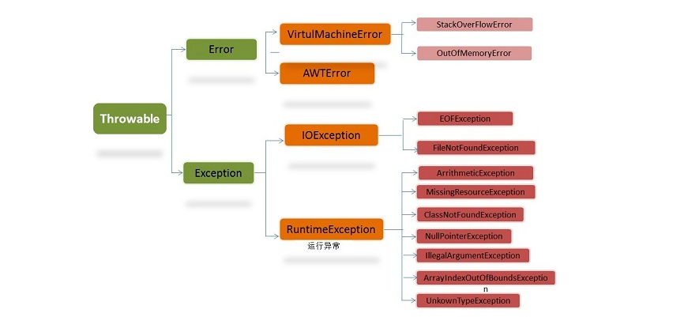


```java
public class ExceptionDemo01 {
	public static void main(String[] args) {
		//java.lang.StackOverflowError 栈内存移出
		//main(args);
		//OutOfMemoryError: Java heap space  堆内存溢出
		//int[] array = new int[1024*1024*1024];
		array[0] = 1;
		array[1] = 2;
		array[2] = 3;
		
//	遍历数组
		try {
			for (int i = 0; i < 4; i++) {
			System.out.println(array[i]);
			}
		}catch(ArrayIndexOutOfBoundsException aoe) {
			System.out.println("系统正在维护，请与管理员联系");
			//打印错误的堆栈信息  查看错误是有谁硬气的
			aoe.printStackTrace();
		}
		System.out.println("遍历完毕");
	}

}
```


**java异常的分类**

Error:称为系统级错误，由Java虚拟机生成并抛出，包括动态链接失败、虚拟机错误等，程序对其不做处理。

Exception:所以异常类的父类，其子类对应了各种各样可能出现的异常事件，一般需要用户显式的声明或捕获。
Runtime Exception:一类特殊的异常，如被О除、数组下标超范围等，其产生比较频繁，处理麻烦，如果显式的声明或捕获将会对程序可读性和运行效率影响很大，因此由系统自动检测并将它们交给缺省的异常处理程序（用户可不必对其处理）		

简单来说：异常与错误的区别是：异常可以通过程序自身捕捉处理，而错误是程序自身无法处理的		

**异常处理机制**
 在 Java 应用程序中，异常处理机制为：抛出异常，捕捉异常。当Java运行时系统接收到异常对象时，会寻找能处理这一异常的代码并把当前异常对象交给其处理，这一过程称为捕获(catch）异常 

抛出异常：当一个方法出现错误引发异常时，方法创建异常对象并交付运行时系统，异常对象中包含了异常类型和异常出现时的程序状态等异常信息。运行时系统负责寻找处置异常的代码并执行。        

捕捉异常：在方法抛出异常之后，运行时系统将转为寻找合适的异常处理器（exception handler）。当异常处理器所能处理的异常类型与方法抛出的异常类型相符时，即为合适的异常处理器当运行时系统遍历调用栈而未找到合适的异常处理器，则运行时系统终止。同时，意味着Java程序的终止

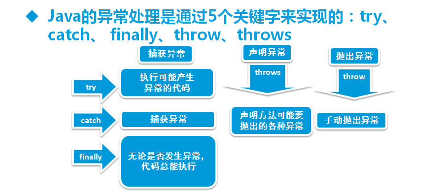

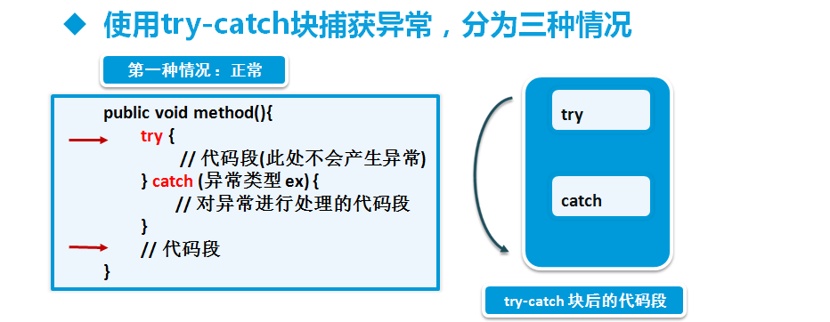


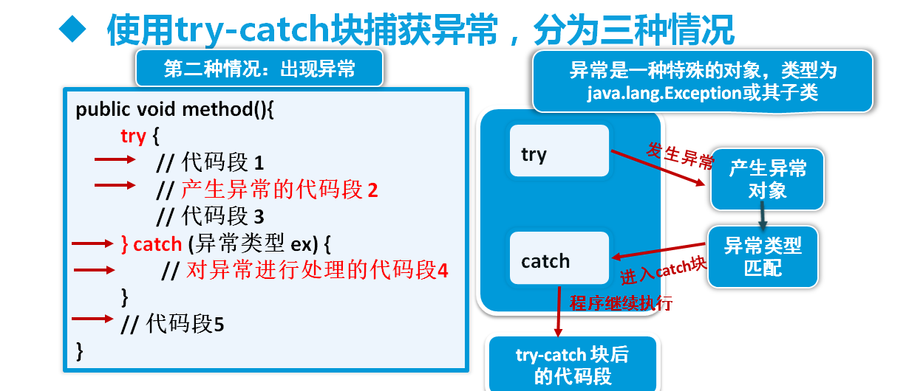


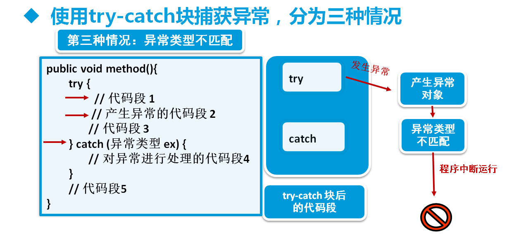

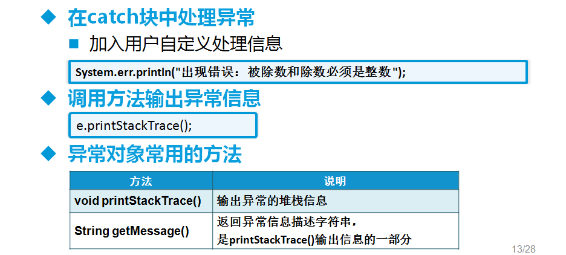

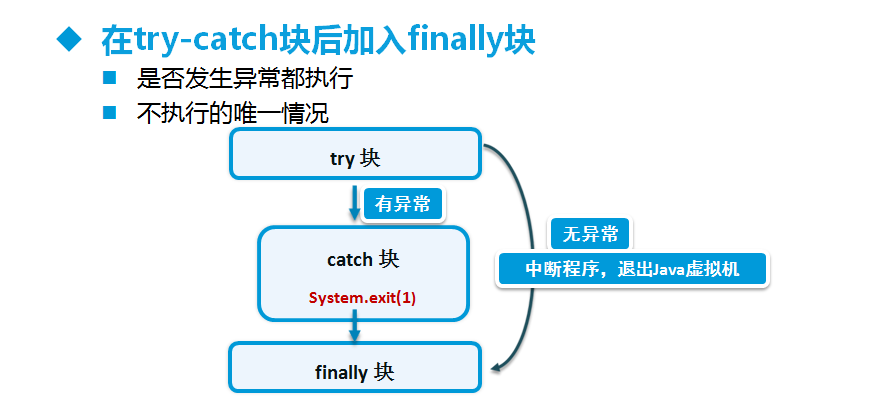

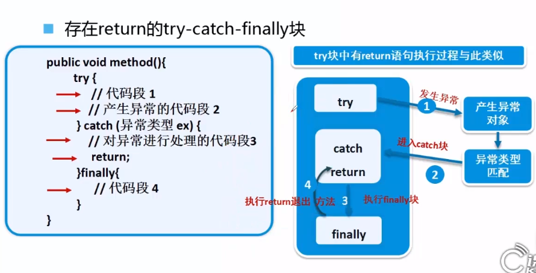

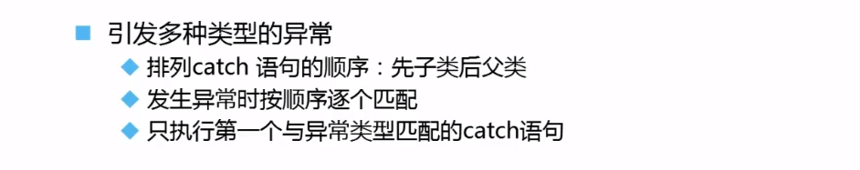

**throws/throw关键字的区别**

|                | throw                                                        | throws                   |
| -------------- | ------------------------------------------------------------ | ------------------------ |
| 抛出的东西不同 | 抛出具体的异常对象                                           | 抛出的是抽象的异常类     |
| 使用位置不同   | 一般用在方法体中，也可用在代码块中，但是如果抛出的是检查时异常类创建的对象，则必须使用try-catch自行处理 | 只能用在方法声明括号后面 |

**自定义异常**


<div class="footer">
	© 2004 Foo Corporation
</div>`

