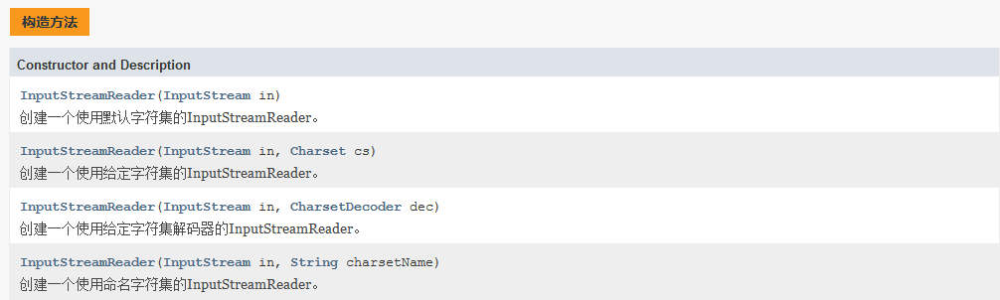

# Java高级特性

## 1.集合框架

**目标：**

- 了解Java集合框架体系结构
- 会使用ArrayList存取数据
- 会使用LinkedList存取数据
- 了解ArrayList与LinkedList区别
- 会使用HashSet存取数据

------

**为什么使用集合框架**

问题：存储一个班级学员的信息，假定一个班级拥有20名学员

解决方案：

​	1.使用数组   需要维护多个数组

​	2.使用对象存储   抽取学生类 Student

问题：如何存储每天的新闻信息     title  id  author

​	1.使用一维数组以对象形式存储     但是现在新闻的数量是无法预知的  因此无法初始化数组的长度

问题：存储一个学生的多门课程的成绩，并能通过课程名字获取对应的成绩

​	1.使用一维数组需要维护两个数组  

因此使用数组是存在局限性的，使用数组存储的数据是相同的数据类型，而且声明数组的时候，数组的长度已经确定，无法自动的扩容。使用集合框架可以很好解决以上的问题

**java集合框架的体系结构**

Java集合框架提供了一套性能优良、使用方便的接口和类，它们位于java.util包中


------

### **List接口**


**ArrayList**


**ArrayList常用方法**


以上方法中标记为红色的是Collection中通用的方法，除了以上的几种外还有


**特点：**

- 底层是数组，数据结构是线型表（需要连续的空间）
- 初始容量是10，jdk1.8之后初始容量是0 ，在添加第一个元素的时候，容量变为10
- 存储的数据是有序 ，不唯一，可以为null值
- 线程是不同步的，多线程时不安全
- 随机查找速度较快，增删操作较慢

------

**LinkedList实现类**

**LinkedList独有的方法**


**LinkedList可以作为LIFO(后进先出)的栈，作为LIFO的栈时，下表的方法等价：**

| 栈方法  | 等效方法      |
| ------- | ------------- |
| push(e) | addFirst(e)   |
| pop()   | removeFirst() |
| peek()  | peekFirst()   |

**LinkedList可以作为FIFO(先进先出)的队列，作为FIFO的队列时，下表的方法等价：**


| 队列方法  | 等效方法      |
| --------- | ------------- |
| add(e)    | addLast(e)    |
| offer(e)  | offerLast(e)  |
| remove()  | removeFirst() |
| poll()    | pollFirst()   |
| element() | getFirst()    |
| peek()    | peekFirst()   |

**特点：**

- 底层实现是节点，数据结构是一个双向链表。它也可以被当作堆栈、队列或双端队列进行操作
- 没有扩容
- 线程是不同步的  多线程时不安全
- 查找较慢  增删较快
- 数据有序，可重复，可以存储null值

------

### **Set接口**


- HashSet

**常用的方法**

| 返回值类型    | 方法描述                                                     |
| ------------- | ------------------------------------------------------------ |
| `boolean`     | `add(E e)`  将指定的元素添加到此集合（如果尚未存在）         |
| `void`        | `clear()`  从此集合中删除所有元素                            |
| `boolean`     | `contains(Object o)`  如果此集合包含指定的元素，则返回 `true` |
| `boolean`     | `isEmpty()`  如果此集合不包含元素，则返回 `true`             |
| `Iterator<E>` | `iterator()`  返回此集合中元素的迭代器                       |
| `boolean`     | `remove(Object o)`  如果存在，则从该集合中删除指定的元素     |
| `int`         | `size()`  返回此集合中的元素数（其基数）。                   |

**特点：**

- 底层是一个哈希表的key   数组+链表
- 初始的容量是16，加载因子是0.75，扩容为当前容量的2倍
- 存储的数据是不保证顺序，唯一的，可以有null值，只允许有一个
- 线程是不同步的  多线程时不安全

**LinkedHashSet**

继承自HashSet

常用的方法参照HashSet

**特征：**

- 底层是哈希表，数据结构是链表
- 数据是有序，唯一的 ，可以是null
- 增删的速度较快
- 线程是不同步的 多线程不安全

**TreeSet**

**特征：**

- 底层实现是TreeMap，数据结构是二叉树
- 不保证顺序，可以自定义排序
- 数据不可以重复，可以为null，只能有一个
- 只能存储可排序的对象  

实现排序的方法：

- 让元素具有排序功能   元素类实现Comparable接口，重写接口中的compareTo方法

```java
public class Student implements Comparable<Student>{
    
   public int compareTo(Student o) {
	} 
    
}
```

- 让容器具有排序功能  创建一个比较的容器类   实现Comparator  重写compare方法

```java
TreeSet<Student> set = new TreeSet<Student>(new Comparator<Student>() {
	@Override
    public int compare(Student o1, Student o2) {
        return 0;
    }
});

```


------

### **Map接口**


**HashMap**

**特点**

1.数据结构

​		jdk1.8之前：数组+单链表

​    	jdk1.8之后：数组+单链表+红黑二叉树（提高查询的效率）

2.初始的容量是16 加载因子0.75

3.当存放的元素达到总容量的0.75时，扩容为原容量的2倍

4.扩容的上限 1<<30

5.其它常量

​			TREEIFY_THRESHOLD = 8   当链表元素达到8时将链表转换为红黑二叉树

​			UNTREEIFY_THRESHOLD = 6  当链表元素减少到6时将二叉树转换为链表

6.无序，key唯一 ，value不唯一，key和value均能为null

7.线程是不同步 ，多线程使用不安全


**常用的方法**

| 返回值            | 方法描述                                                     |
| ----------------- | ------------------------------------------------------------ |
| `V`               | `put(K key,  V value)`  将指定的值与此映射中的指定键相关联   |
| `V`               | `get(Object key)`  返回到指定键所映射的值，或 `null`如果此映射包含该键的映射 |
| `V`               | `remove(Object key)`  从该地图中删除指定键的映射（如果存在）。 |
| `int`             | `size()`  返回此地图中键值映射的数量                         |
| `boolean`         | `isEmpty()`  如果此地图不包含键值映射，则返回 `true`         |
| `void`            | `clear()`  从这张地图中删除所有的映射                        |
| `Set<Entry<K,V>>` | `entrySet()`  返回此地图中包含的映射的[`Set`](../../java/util/Set.html)视图 |
| `Set<K>`          | `keySet()`  返回此地图中包含的键的[`Set`](../../java/util/Set.html)视图 |
| `boolean`         | `containsKey(Object key)`  如果此映射包含指定键的映射，则返回 `true` |
| `boolean`         | `containsValue(Object value)`  如果此地图将一个或多个键映射到指定值，则返回 `true` |
| `Collection<V>`   | `values()`  返回此地图中包含的值的[`Collection`](../../java/util/Collection.html)视图 |

**遍历方式**

1.通过keyset获取所有的key ，然后遍历key 通过get方式获取value

2.获取entrySet，然后遍历

**LinkedHashMap**

1.底层的实现类似HashMap，数据结构是链表

2.有序，key唯一，value唯一，key和value均能为空

**TreeMap**

- 1.数据结构是红黑二叉树
- 2.无序，唯一，key和value均可为null
- 3.可排序，存入的元素需要经过排序（元素具有排序的能力，容器具有排序的能力）
- 4.线程不同步，多线程使用不安全

**Hashtable**

- 底层数据结构是数组+单链表
- 默认的容量是11，加载因子是0.75
- 扩容为原容量的2倍+1
- 无序，key唯一的，value可重复，key和value均不能为空
- 线程同步  多线程使用安全，单线程使用效率较低

**Properties**

- 继承自**Hashtable**
- 可以作为配置信息的存储容器
- 加载配置文件中的信息
- 线程同步的 多线程使用是安全的

**常用的方法**

| 返回值   | 方法描述                                                     |
| -------- | ------------------------------------------------------------ |
| `String` | `getProperty(String key)`  使用此属性列表中指定的键搜索属性  |
| `String` | `getProperty(String key, String defaultValue)`  使用此属性列表中指定的键搜索属性 |
| `Object` | `setProperty(String key, String value)`  致电 `Hashtable`方法 `put` |
| `void`   | `load(InputStream inStream)`  从输入字节流读取属性列表（键和元素对）。 |

------

**Collections工具类的使用**

集合的工具类

**常用的方法**

| 返回值  | 方法描述                                                     |
| ------- | ------------------------------------------------------------ |
| List<T> | `synchronizedList(List<T> list)`  返回由指定列表支持的同步（线程安全）列表 |
| `void`  | `sort(List<T> list, Comparator<? super T> c)`  根据指定的比较器引起的顺序对指定的列表进行排序。 |
| `void`  | `sort(List<T> list)`  根据其元素的*自然顺序*表进行排序       |
| `void`  | `reverse(List<?> list)`  反转指定列表中元素的顺序            |
|         | `max(Collection<? extends  T> coll)`  根据其元素的 *自然顺序*返回给定集合的最大元素 |
|         | `min(Collection<? extends  T> coll)`  根据其元素的 *自然顺序*返回给定集合的最小元素 |

------

## **2.泛型**

**1.掌握泛型的作用**

案例1：泛型在集合中的使用  不使用泛型会出现转换异常

案例:2：建立坐标点类（1,2）（一，二） 无法确定坐标点的写法

## 3.枚举

- [ ] 理解为什么使用枚举    

  保证数据的合理性，类型安全，易于输入，代码清晰

- [ ] 掌握什么是枚举

  枚举是一组固定的常量组成的类型

- [ ] 掌握如何使用枚举

```java
public enum  Gender{
   男,女  //列举的男女 实际是Gender的对象
}

//支持私有的有参构造 和私有的属性
```

案例1：使用枚举实现根据星期几，给出工作计划

案例2：java学习阶段定义枚举：L1，L2，L3，分别表示第1，2，3个阶段，输出每个阶段的学习目标，

​				L1:     java开发工程师

​				L2：大数据开发工程师

​				L3：大数据挖掘工程师

## 4.包装类

java中认为一切皆对象，引用数据类型就是对象类型，但是在java中有8中基本类型不是对象，只是表示一种数据的类型形式，java中为了一切皆对象思想的统一，把8中基本类型转换成对应的类，这个类就是基本类型的包装类

| 基本类型 | 包装类（引用数据类型） |
| -------- | ---------------------- |
| byte     | Byte                   |
| short    | Short                  |
| int      | Integer（特殊）        |
| long     | Long                   |
| float    | Float                  |
| double   | Double                 |
| char     | Character（特殊）      |
| boolean  | Boolean                |

### 4.1自动装箱和自动拆箱

自动装箱：可以直接将基本类型的值或者变量赋值给包装类

自动拆箱：可以把包装类的变量直接赋值给基本数据类型

### 4.2包装类的常用方法 

重点讲解Integer的方法，其他的包装类请参照API文档

| 返回值    | 方法描述                                                     |
| --------- | ------------------------------------------------------------ |
| `int`     | `parseInt(String s)`  将字符串参数解析为带符号的十进制整数   |
| `int`     | `sum(int a,  int b)`  根据+运算符将两个整数相加              |
| `int`     | `max(int a,  int b)`  返回两个 `int`的较大值，就像调用 [`Math.max`一样](../../java/lang/Math.html#max-int-int-) |
| `int`     | `min(int a,  int b)`  返回两个 `int`的较小值，就像调用 [`Math.min`一样](../../java/lang/Math.html#min-int-int-) |
| `Integer` | `valueOf(String s)`  返回一个 `Integer`对象，保存指定的值为 `String` |
| `Integer` | `valueOf(int i)`  返回一个 `Integer`指定的 `int`值的  `Integer`实例 |
| `Integer` | `valueOf(String s,  int radix)`  返回一个 `Integer`对象，保存从指定的String中  `String`的值，当用第二个参数给出的基数进行解析时 |
| 最小值    | MIN_VALUE                                                    |
| 最大值    | MAX_VALUE                                                    |
| 占的位数  | SIZE                                                         |

补充：

1.BigDecimal  精确浮点数的运算

**创建对象**

​	BigDecimal bd = BigDecimal.valueOf(double val);

**常用方法**

- ​	add(BigDecimal  val)
- ​	subtract(BigDecimal  val)
- ​	multiply(BigDecimal  val)
- ​	divide(BigDecimal  val)

## 5.常用类介绍

### 5.1String类

String 创建的字符串存储在公共池中，而 new 创建的字符串对象在堆上

```java
String s1 = "Runoob";              // String 直接创建
String s2 = "Runoob";              // String 直接创建
String s3 = s1;                    // 相同引用
String s4 = new String("Runoob");   // String 对象创建
String s5 = new String("Runoob");   // String 对象创建
```


String 类是不可改变的，所以你一旦创建了 String 对象，那它的值就无法改变了，但是字符串的引用可以复制

```java
String str1 = "helloworld";
String str2 = "hello";

String str3 = "hello"+"world";
System.out.println(str1==str3);

String str4 = str2+"world";
System.out.println(str4==str3);
```

常用方法

| 返回值   | 方法描述                                                     |
| -------- | ------------------------------------------------------------ |
| int      | `length()`  返回此字符串的长度                               |
| char     | ` charAt(int index)`返回 char指定索引处的值                  |
| String   | ` concat(String str) ` 将指定的字符串连接到该字符串的末尾    |
| boolean  | `contains(CharSequence s)`  当且仅当此字符串包含指定的char值序列时才返回true |
| boolean  | `startsWith(String prefix)`  测试此字符串是否以指定的前缀开头 |
| boolean  | `endsWith(String suffix)`  测试此字符串是否以指定的后缀结尾  |
| int      | `indexOf(int ch)`  返回指定字符第一次出现的字符串内的索引    |
| int      | `indexOf(String str)`  返回指定子字符串第一次出现的字符串内的索引 |
| int      | `lastIndexOf(int ch)`  返回指定字符的最后一次出现的字符串中的索引 |
| int      | `lastIndexOf(String str)`  返回指定子字符串最后一次出现的字符串中的索引 |
| String   | `replace(char oldChar,  char newChar)`  返回从替换所有出现的导致一个字符串 `oldChar`在此字符串  `newChar` |
| String[] | `split(String regex)`  将此字符串分割为给定的 [regular  expression的](../util/regex/Pattern.html#sum)匹配 |
| String   | `substring(int beginIndex)`  返回一个字符串，该字符串是此字符串的子字符串 |
| String   | `substring(int beginIndex,  int endIndex)`  返回一个字符串，该字符串是此字符串的子字符串 |
| char[]   | `toCharArray()`  将此字符串转换为新的字符数组                |
| String   | `toLowerCase()`  将所有在此字符 `String`使用默认语言环境的规则，以小写 |
| String   | `toUpperCase()`  将所有在此字符 `String`使用默认语言环境的规则大写 |
| String   | `trim()`  返回一个字符串，其值为此字符串，并删除任何前导和尾随空格 |
| String   | `valueOf(int i)`  返回 `int`参数的字符串 `int`形式           |

案例：

1.截取网址的域名http://www.baidu.com       http://www.baidu.com.cn

2.判断文字是否是回文（上海自来水来自海上）

**补充：**正则表达式

正则表达式是描述一种字符串的格式，用于验证字符串的内容是否满足格式的标准。

| 正则表达式    | 说明                                          |
| ------------- | --------------------------------------------- |
| [abc]         | a、b、c中的任意一个字符                       |
| [^abc]        | 除了abc的任意字符                             |
| [a-z]         | a-z中的任意一个字符                           |
| [a-zA-Z0-9]   | a-zA-Z0-9之间的任意一个字符                   |
| [a-z&&[ ^bc]] | a-z中除了bc以外的任意一个字符  &&表示与的关系 |
| .             | 表示任意的字符                                |
| \d            | 任意一个数字字符                              |
| \w            | 任意一个单词字符，相当于[a-zA-Z0-9]           |
| \s            | 空白字符                                      |
| \D            | 非数字字符                                    |
| \W            | 非单词字符                                    |
| \S            | 非空白字符                                    |

**正则表达式的数量词**

| 数量词  | 说明                |
| ------- | ------------------- |
| X?      | X出现一次或零次     |
| X*      | X出现零次或多次     |
| X+      | X出现一次到任意多个 |
| X{n}    | 出现n 次            |
| X{n，}  | 至少出现n次         |
| X{n，m} | 出现N次到M次        |

**正则表达式表示开始和结束的符号**

- ^表示以什么开始  ^[abc]{3}   abcdfgh
- $表示以什么结束[abc]{3}$

邮箱的正则表达式

\w+@\ w+(\ . [a-zA-Z]+)+

手机号的正则表达式

1[3456789] [0-9]{9}

#### **StringBuffer和StringBuilder**

1.字符串的缓冲区/字符换的创建者
 2.StringBuffer  线程安全的  多线程时执行的效率较差  1.0
 3.StringBuilder 线程不安全的 执行的效率较高  	   1.5

------

### 5.2UUID

**UUID** 是指Universally Unique Identifier，翻译为中文是**通用唯一识别码**，UUID 的目的是让分布式系统中的所有元素都能有唯一的识别信息。如此一来，每个人都可以创建不与其它人冲突的 UUID，就不需考虑数据库创建时的名称重复问题。

```java
String Str1=UUID.randomUUID().toString().replace("-", "");
```

### 5.3Random

**所处的包：**java.util.Random

**构造方法：**

- Random()：创建一个新的随机数生成器，当前的构造方法以当前的系统时间System.nanoTime()纳秒为种子
- Random(long seed)：使用单个 long 种子创建一个新的随机数生成器
- 你在创建一个Random对象的时候可以给定任意一个合法的种子数，种子数只是随机算法的起源数字，和生成的随机数的区间没有任何关系

```java
Random rand =new Random(25);
int i;
i=rand.nextInt(100);
```

rand.nextInt(100);中的100是随机数的上限,产生的随机数为0-100的整数,不包括100，对于种子相同的Random对象，生成的随机数序列是一样的

```java
Random ran1 = new Random(10);
System.out.println("使用种子为10的Random对象生成[0,10)内随机整数序列: ");
for (int i = 0; i < 10; i++) {
    System.out.print(ran1.nextInt(10) + " ");
   }
System.out.println("*******************************************");
Random ran2 = new Random(10);
System.out.println("使用另一个种子为10的Random对象生成[0,10)内随机整数序列: ");
for (int i = 0; i < 10; i++) {
    System.out.print(ran2.nextInt(10) + " ");
  }
```

案例：猜数字小游戏，提示用户输入的值大了，还是小了，直到猜对为止

### 5.4Math

**Math中的常量**

**E：自然对数**

1.如果a^n=b，那么log(a)(b)=n。其中，a叫做“底数”，b叫做“真数”，n叫做“以a为底b的对数”

2.上例中如果“底数”a是一个很特殊的数  2.718281828...就称为“自然对数”,这里的2.718281828...是一个无理数，称为“自然对数的底数”，通常用小写字母e表示

**PI：圆周率**

```java
System.out.println(Math.E);//2.718281828459045
System.out.println(Math.PI);//3.141592653589793
```

**常用的方法：**

| 方法            | 描述              |
| --------------- | ----------------- |
| Math.sqrt()     | 计算平方根        |
| Math.cbrt()     | 计算立方根        |
| Math.pow(a, b)  | 计算a的b次方      |
| Math.max( a,b ) | 计算最大值        |
| Math.min(a , b) | 计算最小值        |
| Math.random()   | 获取[0,1)的随机值 |
| Math.round()    | 四舍五入          |
| Math.floor(x)   | 向下取整          |
| Math.ceil(x)    | 向上取整          |
| Math.abs(x)     | 返回绝对值        |

### 5.4Date日期类    

UTC：世界标准时间  

GMT：格林威治标准时间

CST：中国标准时间

**1.创建对象的方式**

- Date() 获取当前系统时间
- Date(long date)通过指定毫秒值，获取指定时间

**2.Date类中的方法基本都已经弃用，以下是一些保留的常用方法**

- getTime() 返回自1970年1月1日以来，由此 Date对象表示的00:00:00 GMT的毫秒数
- setTime(long time) 设置此 Date对象以表示1970年1月1日00:00:00 GMT后的 time毫秒的时间点
- after(Date when) 测试此日期是否在指定日期之后
- before(Date when) 测试此日期是否在指定日期之前
- compareTo(date)     比较日期的大小

**3.日期格式化工具**

- 把Date对象格式化成指定的格式

- 把时间格式的字符串，转换成Date对象

- **创建格式化对象**      SimpleDateFormat sdf= new SimpleDateFormat("格式字符串");

  

  **方法：**

  1.format(Date date)  将给定的Date按照指定的格式转换成一个字符串

  2.parse(String date)  将一个字符串解析为Date

  案例：输入生日（yyyy-MM-dd）计算已经生存了多少天，生存20000天的纪念日是哪一天？

### 5.5Calendar日历类

Calendar（格里高利历）是一个日历类，提供了很多操作日期的API，该类是一个抽象类，不能直接创建对象，但是该类提共了一个getInstance（）方法可以获取一个对象的实例。

```java
//默认显示当前系统时间
Calendar calendar = Calendar.getInstance();
Date time = calendar.getTime();

//获取时间分量的信息   年 月 日 时分秒
Calendar calendar = Calendar.getInstance();
//获取年
int year = calendar.get(Calendar.YEAR);
System.out.println(year);
//获取月(从0开始标记)
int month = calendar.get(Calendar.MONTH);
/*
* 获取日
* DAY_OF_MONTH
* DAY_OF_YEAR
* DAY_OF_WEEK
* */
int day = calendar.get(Calendar.DAY_OF_MONTH);
//时
calendar.get(Calendar.HOUR);
//分
calendar.get(Calendar.MINUTE);
//秒
calendar.get(Calendar.SECOND);

//获取某个时间分量的最大值
calendar.getActualMaximum(Calendar.DAY_OF_MONTH);
//今天是今年的第几天
calendar.get(Calendar.DAY_OF_YEAR);
//今天是周几

//设置指定的日期
Calendar cd = Calendar.getInstance();
cd.set(Calendar.YEAR, 2021);
cd.set(Calendar.MONTH,7);
cd.set(Calendar.DATE, 8);

cd.set(Calendar.HOUR_OF_DAY, 20);
cd.set(Calendar.MINUTE, 20);
cd.set(Calendar.SECOND, 20);
System.out.println(cd.getTime()); //此时才会生效

```

**使用Calendar计算时间**

add（int field，int amount），对给定的时间分量进行运算，整数是向后加，负数是向前减

案例1：计算1年2个月15天以后的日期

案例2：计算超市商品的促销日（输入商品的生产日期（yyyy-MM-dd）保质期天数，经过计算输出商品的促销日（yyyy-MM-dd），商品的促销日是商品过期日的前两周的周三）

### 5.6JAVA8新日期类

java.time包 时间处理类

1..LocalDateTime 类   私有的构造方法 不能直接new对象

```mysql
// LocalDateTime

LocalDateTime now = LocalDateTime.now();
System.out.println(now);

//常用的方法 of(int year, int month, int dayOfMonth, int hour, int minute, int second) 
//一系列的get方法
//格式化的方法
DateTimeFormatter dtf = DateTimeFormatter.ofPattern("yyyy-MM-dd HH:mm:ss");
String format = now.format(dtf);
System.out.println(format);

//LocalDateTime 和 LocalDate, LocalTime 相互转换
LocalDate localDate1 = localDateTime.toLocalDate();
LocalTime localTime1 = localDateTime.toLocalTime(); 


//Date ->LocalDateTime;
//时间戳 1.8
Date date = new Date();
Instant instant = date.toInstant();
//获取时区
LocalDateTime ldt = instant.atZone(ZoneId.systemDefault()).toLocalDateTime();
System.out.println(ldt);

//LocalDateTime ->Date;
LocalDateTime ldt1 = LocalDateTime.now();
Instant instant2 = ldt1.atZone(ZoneId.systemDefault()).toInstant();
Date from = Date.from(instant2);
System.out.println(from);
//封装工具类 实现转换
```

2.LocalDate类

```java
LocalDate localDate = LocalDate.of(2019, 2, 14);
System.out.println(localDate);
int year = localDate.getYear(); //那一年
System.out.println("year = " + year);
Month month = localDate.getMonth(); // 第几个月
System.out.println("month = " + month);
int dayOfMonth = localDate.getDayOfMonth(); //一个月的第几天
System.out.println("dayOfMonth = " + dayOfMonth);
DayOfWeek dayOfWeek = localDate.getDayOfWeek(); //一周的第几天
System.out.println("dayOfWeek = " + dayOfWeek);
int lenth = localDate.lengthOfMonth(); // 一个月的天数
System.out.println("lenth = " + lenth);
boolean leapYear = localDate.isLeapYear(); // 是否是闰年
System.out.println("leapYear = " + leapYear);

//获取当前日期
System.out.println("LocalDate.now() = " + LocalDate.now());
```

3.LocalTime 类

```java
// LocalTime 包含具体时间
LocalTime localTime = LocalTime.of(22, 10, 59);
System.out.println("localTime = " + localTime);
```

## 6.Lambda表达式

lambda表达式，可以让java函数式编程，该特性是java1.8之后推出的，使用lambda表达式可以方便快捷的创建匿名内部类，使用lambda编写的匿名内部类只能含有一个抽象的方法，否则编译不通过。

语法：

（参数列表）—>{

​			方法体

}

创建函数式接口

```java
@FunctionalInterface
public interface LambdaInterface {

	//	void say();
	// void say(String str);

	// 无参带返回值
	// String say();
	// 有参数带返回值
	String say(String str);
}
```

1.如果方法体中只有一条语句  大括号可省

2.如果只有一个参数，那么小括号可省略

3.如果方法有返回值，且只有一条语句return和大括号可省略

## 7.File

java.io包中的类，文件和目录路径名字的抽象表示,只能操作文件的属性，不能读取文件的内容

**路径：**

绝对路径：全路径，以盘符开始的路径

相对路径：简化路径  现对于当前项目的根目录

**1.常用的构造方法**

File(String pathname) 通过将给定的路径名字符串转换为抽象路径名来创建新的 File实例，不关心给定的路径是否存在，只是用于创建File对象

 File（String parent，String child） 操作路径更加的灵活

 File（File parent，String child）  可以使用File类中封装的一些方法，操作路径

**2.常用的方法**

**操作文件**

- 获取文件属性 

| 方法名              | 描述                                     |
| ------------------- | ---------------------------------------- |
| getName()           | 返回由此抽象路径名表示的文件或目录的名称 |
| canRead()           | 是否可以读取由此抽象路径名表示的文件     |
| canWrite()          | 是否可以修改由此抽象路径名表示的文件     |
| exists()            | 测试此抽象路径名表示的文件或目录是否存在 |
| isDirectory()       | 测试此抽象路径名表示的文件是否为目录     |
| isFile()            | 测试此抽象路径名表示的文件是否为普通文件 |
| isHidden()          | 测试此抽象路径名命名的文件是否为隐藏文件 |
| lastModified()      | 返回此抽象路径名表示的文件上次修改的时间 |
| length()            | 返回由此抽象路径名表示的文件的长度       |
| renameTo(File dest) | 重命名由此抽象路径名表示的文件           |

- 创建文件

```java
createNewFile() //当且仅当具有该名称的文件尚不存在时，原子地创建一个由该抽象路径名命名的新的空文件
```

- 删除文件

```java
delete()  //删除由此抽象路径名表示的文件或目录
```

**操作文件夹**

- 创建文件夹

```java
mkdir() //创建由此抽象路径名命名的目录
mkdirs()  //创建由此抽象路径名命名的目录，包括任何必需但不存在的父目录
listFiles()   //返回一个抽象路径名数组，表示由该抽象路径名表示的目录中的文件
```

- 删除文件夹

```java
delete() //只能删除空的文件夹
    
//如何删除非空的文件夹
public void deleteFile(File file){
    
    	if(file.isDirectory()){
       	  File [] files =  file.fileList();
            for(File file:files){
                delete(file);
         	}
            
      	}
    	
    		file.delete();
}
```

**补充：实现文件的过滤**

**FileFilter**

## 8.IO流

### **流的概念和作用**

流是一组有顺序的，有起点和终点的字节集合，是对数据传输的总称或抽象。即数据在两设备间的传输称为流，流的本质是数据传输，根据数据传输特性将流抽象为各种类，方便更直观的进行数据操作

**IO流的分类**

- 根据处理数据类型的不同分为：字符流和字节流
- 根据数据流向不同分为：输入流和输出流

**输出流:**

把程序(内存)中的内容输出到磁盘、光盘等存储设备中


**输入流**

读取外部数据（磁盘、光盘等存储设备的数据）到程序（内存）中


 **字节流和字符流的区别：**

- 读写单位不同：字节流以字节（8bit）为单位，字符流以字符为单位，根据码表映射字符，一次可能读多个字节。

- 处理对象不同：字节流能处理所有类型的数据（如图片、avi等），而字符流只能处理字符类型的数据。

- 字节流：一次读入或读出是8位二进制。

- 字符流：一次读入或读出是16位二进制。


设备上的数据无论是图片或者视频，文字，它们都以二进制存储的。二进制的最终都是以一个8位为数据单元进行体现，所以计算机中的最小数据单元就是字节。意味着，字节流可以处理设备上的所有数据，所以字节流一样可以处理字符数据。

因此：`只要是处理纯文本数据，就优先考虑使用字符流。 除此之外都使用字节流`

### **IO流的体系结构**


### **字节流**

1.OutputStream

这个抽象类是表示字节输出流的所有类的超类。 输出流接收输出字节并将其发送到某个接收器，该类是一个抽象类，不能直接创建对象，创建对象需要使用其子类。


**方法摘要**


**常用的实现类** 

FileOutputStream  文件字节输出流，将内存中的数据写入到硬盘中的文件中

- 构造方法

 FileOutputStream(String name) 创建文件输出流以指定的名称写入文件

FileOutputStream(File file) 创建文件输出流以写入由指定的 File对象表示的文件

FileOutputStream(String name, boolean append) 创建文件输出流以指定的名称写入文件，可实现追加数据的追加

根据构造方法中传递的参数，创建一个空文件，让创建的字节输出流对象指向该文件

**操作流的步骤：**

第一步：1：打开流（即创建流）
第二步：2：通过流读取(写出)内容
第三步：3：用完后，关闭流资源

**常用方法介绍**

1.调用对象的write（int b）方法，写出一个字节到文件中

```java
public void test01() throws Exception {
		//创建流
		FileOutputStream fos = new FileOutputStream("E:/a.txt");
		//写出数据
		fos.write(97);
		//关闭流
		fos.close();
}
```


2.调用对象的write（byte[]  b）方法，将字节数组写出到文件中

```java
//将名字的拼音在文本文档中显示  mengshun
public void test02() throws Exception {//写出一个字节数组
		FileOutputStream fos = new FileOutputStream("E:/b.txt");
		byte[] name = {109,101,110,103,95,115,104,117,110};
		fos.write(name);
		fos.close();
}
```

3.调用对象的write（byte[]  b，int off，int len）方法，将字节数组从偏移量off开始写出len个字节到文件中

```java
public void test03() throws Exception {//写出字节数组的部分到文件
		FileOutputStream fos = new FileOutputStream("E:/c.txt");
		byte[] name = {109,101,110,103,95,115,104,117,110};
		fos.write(name, 5, 4);	
    	fos.close();
}
```

4.将字符串写出到文件中

```java
public void test04() throws Exception {//将字符串写出到文件
		FileOutputStream fos = new FileOutputStream("E:/c.txt");
		String str = "合肥一元";
		fos.write(str.getBytes());
		fos.close();
}
```

5.数据的追加和换行

```java
public void test04() throws Exception {//将字符串写出到文件,实现追加
		FileOutputStream fos = new FileOutputStream("E:/c.txt",true);
		String str = "合肥一元";
		fos.write(str.getBytes());
		fos.close();
}

//实现换行

public void test04() throws Exception {//将字符串写出到文件,实现追加
		FileOutputStream fos = new FileOutputStream("E:/c.txt",true);
		String str = "合肥一元";
    
		fos.write(str.getBytes());
		fos.close();
}
```

2.InputStream

InputStream有read方法，一次读取一个字节，但是该类是一个抽象类，是所有字节输入流的超类，不能直接创建对象，因此需要使用器子类构建对象。


**方法摘要**


案例一：使用 `read()`方法，一次读取一个字节,读到文件末尾返回-1，频繁的操作硬盘，效率较低

```java
public void test05() throws Exception {//字节输入流的使用
		
    FileInputStream fis = new FileInputStream("E:/a.txt");
    //每次读取一个字节  读取到文件的末尾 返回-1
    int read = -1;
    while((read=fis.read())!=-1) {
        System.out.println((char)read);
    }
    fis.close();
}
```

案例二：使用read(byte[] bs)方法的时候，可以将读到的数据装入到字节数组中，一次性的操作数组，可以提高效率。

```java
@Test
	public void test06() throws Exception {//每次读取多个字节
		FileInputStream fis = new FileInputStream("E:/a.txt");
		byte[] bs = new byte[3];
		int len = -1;
		while((len=fis.read(bs))!=-1) {//fis.read(bs) 返回实际读取的字节数 读取末尾返回-1
			for (byte b : bs) {
				System.out.println(b);
			}
		}
        fis.close();
	}
```

案例三：使用read(byte[] bs，int off，int len)方法

```java
@Test
	public void test07() throws Exception {
		FileInputStream fis = new FileInputStream("E:/a.txt");
		byte[] bs = new byte[7];
		int read = fis.read(bs, 3, 1);
		System.out.println(read);
		System.out.println(new String(bs));
		
	}
```

实操：使用字节输入流和字节输出流实现文件的复制（使用字节和字节数组分别实现）

```java
public void test08() throws Exception {//使用字节流实现文件的复制
		FileInputStream fis = new FileInputStream("E:/4.jpg");
		FileOutputStream fos = new FileOutputStream("E:/copy.jpg");
		
		int len = -1;
		System.out.println("开始复制");
		long start = System.currentTimeMillis();
		while((len = fis.read())!=-1) {
			fos.write(len);
		}
		long end = System.currentTimeMillis();
		System.out.println("复制结束,用时:"+(end-start)+"毫秒");
		//释放资源
		fos.close();
		fis.close();
	}
```

```java
	public void test09() throws Exception {//使用字节流数组 实现复制 比较赋值效率
		FileInputStream fis = new FileInputStream("E:/4.jpg");
		FileOutputStream fos = new FileOutputStream("E:/copy.jpg");
		byte[] bs = new byte[1024];
		int len = -1;
		System.out.println("开始复制");
		long start = System.currentTimeMillis();
		while((len = fis.read(bs))!=-1) {
			fos.write(bs,0,len);
		}
		long end = System.currentTimeMillis();
		System.out.println("复制结束,用时:"+(end-start)+"毫秒");
		//释放资源
		fos.close();
		fis.close();	
	}
```

使用字节流读取中文文件

```java
public void test10() throws Exception {//使用字节流读取中文字符
		FileInputStream fis = new FileInputStream("E:/a.txt");
		int len = -1;
		while((len = fis.read())!=-1) {
			System.out.println((char)len);
		}
	//四个文字读取出了八个字节数字	字符的编码格式gbk  2字节  utf-8 3字节
}
```

### **字符流**

**字符输出流**

java.io.Writer


**FileWriter**


**方法摘要**

参照OutputStreamWriter

**字符输入流**

java.io.Reader

用于读取字符流的抽象类。 子类必须实现的唯一方法是read（char []，int，int）和close（）。 然而，大多数子类将覆盖这里定义的一些方法，以便提供更高的效率


**方法摘要**


**缓冲流**

字节缓冲流

- 字节输入缓冲流

  java.io.BufferedInputStream   提高了读取字节的速度，类内部自己维护了一个数组

  

- 字节输出缓冲流

  java.io.BufferedOutputStream   提高了写出字节的速度

  

```java
public void test03() throws Exception {//缓冲流实现文件的复制
		
		FileInputStream fis = new FileInputStream("E:/4.jpg");
		FileOutputStream fos = new FileOutputStream("E:/copy.jpg");
		//创建缓冲流对象
		BufferedInputStream bis = new BufferedInputStream(fis);
		BufferedOutputStream bos = new BufferedOutputStream(fos);
		int len = -1;
		byte[] bs = new byte[1024];
		System.out.println("开始复制");
		long start = System.currentTimeMillis();
		while((len=bis.read(bs))!=-1) {
			fos.write(bs,0,len);
			
		}
		long end = System.currentTimeMillis();
		System.out.println("复制完毕，耗时："+(end-start));

	}

```

字符缓冲流

- 字符输出缓冲流

  java.io.BufferedWriter   从字符输出流读取文本，缓冲字符，以提供字符，数组和行的高效写出

  

- 字符输入缓冲流

  java.io.BufferedReader  从字符输入流读取文本，缓冲字符，以提供字符，数组和行的高效读取

  

```java
public void test09() throws Exception {//字符缓冲流实现文件的对拷贝
		
//		FileReader fr = new FileReader("E:/fw.txt");
//		FileWriter fw = new FileWriter("E:/fw1.txt");
		
	InputStreamReader isr = new InputStreamReader(new FileInputStream("E:/fw.txt"), "gbk");
	OutputStreamWriter osw = new OutputStreamWriter(new FileOutputStream("E:/fw1.txt"),"gbk");
	
    BufferedReader br = new BufferedReader(isr);
	BufferedWriter bw = new BufferedWriter(osw);
		
	char[] cs = new char[1024];
	int len = -1;
		
	System.out.println("开始复制文本");
	long start = System.currentTimeMillis();
	while((len = br.read(cs))!=-1) {
		bw.write(cs, 0, len);
	}
	long end = System.currentTimeMillis();
	System.out.println("复制文本结束，用时："+(end-start)+"毫秒");
	
	}
```

**转换流**

OutputStreamWriter是字符输出流和字节输出流的桥梁，称之为转换流，可以指定写出的字符编码，或者接受平台的默认字符集


InputStreamReader是字符输入流和字节输入流的桥梁，称之为转换流，可以指定读取的字符编码，或者接受平台的默认字符集



### 对象流

可以很方便的将对象以字节的形式写出到文件，该流也是一个高级流，可以读写java中的任何对象，但是能被对象流读写的java对象必须是实现序列化接口的对象。

ObjectInputStream反序列化先前使用ObjectOutputStream编写的原始数据和对象

ObjectOutputStream 只有支持java.io.Serializable接口的对象才能写入流中。  每个可序列化对象的类被编码，包括类的类名和签名，对象的字段和数组的值以及从初始对象引用的任何其他对象的关闭

```java
public void test10() throws Exception {//写出对象到文件
		
		Student student = new Student();
		student.setAge(10);
		student.setBirth(new Date());
		student.setSex(1);
		
		ObjectOutputStream oos = new  ObjectOutputStream(new FileOutputStream("studen.txt"));
		oos.writeObject(student);
		oos.close();

	}

public void test11() throws Exception {//读取对象到java程序
		
		ObjectInputStream ois = new ObjectInputStream(new FileInputStream("studen.txt"));
		Object obj= ois.readObject();
		Student student = (Student)obj;
		System.out.println(student);
	
}
```

## 9.多线程


## 10.网络编程


## 11.注解


## 12.反射


## 13.XML


